#### Table of contents
* [The structure of section webchat.theme in the configuration file settings.json](#the-structure-of-section-webchattheme-in-the-configuration-file-settingsjson)
* [First configuration level. Application type](#first-configuration-level-application-type)
* [Second configuration level. Component styles](#second-configuration-level-component-styles)
* [Component styles](#component-styles)
	* [Global](#global)
	* [AttachmentButton](#attachmentbutton)
	* [BackButton](#backbutton)
	* [Button](#button)
	* [Chat](#chat)
	* [ChatBody](#chatbody)
	* [ChatButton](#chatbutton)
	* [ChatHeader](#chatheader)
	* [ChatInput](#chatinput)
	* [ChatInvite](#chatinvite)
	* [ChatMessagesBadge](#chatmessagesbadge)
	* [ChatPoll](#chatpoll)
	* [ChatWelcome](#chatwelcome)
	* [CloseButton](#closebutton)
	* [DateBar](#datebar)
	* [Emoji](#emoji)
	* [EmojiButton](#emojibutton)
	* [InputText](#inputtext)
	* [Link](#link)
	* [MessageClient](#messageclient)
	* [MessageOperator](#messageoperator)
	* [MessageTime](#messagetime)
	* [Offline](#offline)
	* [Preloader](#preloader)
	* [Preview](#preview)
	* [QuickQuestions](#quickquestions)
	* [ScrollButton](#scrollbutton)
	* [ScrollButtonBadge](#scrollbuttonbadge)
	* [SocialLinks](#sociallinks)
	* [Typing](#typing)
	* [WebView](#webview)

### The structure of section webchat.theme in the configuration file settings.json

```json
{
    "fonts": [
        "/font1.css",    
        "https://example.com/font2.css"    
    ],
    "desktop": {
        "Global": {},
        "component1": {},
        "component2": {},
        "componentN": {}
    },
    "mobile": {
        "Global": {},
        "component1": {},
        "component2": {},
        "componentN": {}
    }
}
```

### First configuration level. Application type

There are following sections on the first configuration level:
* `fonts` - array of references to CSS-files of web fonts
* `desktop` - widget style for desktop browsers
* `mobile` - widget style for mobile browsers. Inherits styles of desktop section and allows to override them
* `mobileS` - styles in this section are used for the mobile devices withe the display width up to 320px. Inherits the styles of section `mobile` and allows to override them
* `mobileM` - styles in this section are used for the mobile devices withe the display width from 321px to 425px. Inherits the styles of section `mobile` and allows to override them
* `mobileL` - styles in this section are used for the mobile devices withe the display width from 376px to 425px. Inherits the styles of section `mobile` and allows to override them
* `tablet` - styles in this section are used for the mobile devices withe the display width from 426px to 1023px. Inherits the styles of section `mobile` and allows to override them

**Important!**

For ease of use the "send" button is enabled by default on mobile devices. By default it has white color.
We would recommend to configure the button in the section "mobile" so it follows your guideline (element [[ChatInput]]).

### Second configuration level. Component styles

The second level contain components and their styles. Also, the level contains section `Global` which has styles to be inherited by the second level components (but can be overridden by component styles). For example, Global contains color text, this color will be used by all components, if the other color is not defined in the component styles. The inheritance chain is as follows:

`desktop/Global` --> `desktop/Component` --> `mobile/Global` --> `mobile/Component`

### Component styles

The most of the settings are just standard CSS-properties. The list of the components available for the editing is listed below.

#### Global

The basic properties. Applicable to all components if not overridden by the component properties.

| Setting name | CSS property | Description |
|----------------------------------|--------------------------------|---------------------------------|
| fontFamily | [font-family](http://htmlbook.ru/css/font-family) | Font family |
| fontSize | [font-size](http://htmlbook.ru/css/font-size) | Font size |
| color | [color](http://htmlbook.ru/css/color) | Text color |

#### AttachmentButton

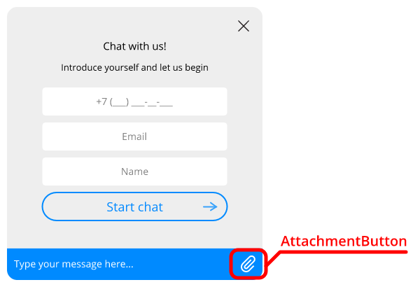

Used to add attachments.

| Setting name | CSS property | Description |
|----------------------------------|--------------------------------|---------------------------------|
| opacity | [opacity](http://htmlbook.ru/css/opacity) | Opacity |
| borderColor | [border-color](http://htmlbook.ru/css/border-color) | Border color |
| borderLeftWidth | [border-left-width](http://htmlbook.ru/css/border-left-width) | Left border width |
| backgroundSize | [background-size](http://htmlbook.ru/css/background-size) | Button image size |
| height | [height](http://htmlbook.ru/css/height) | Button height |
| width | [width](http://htmlbook.ru/css/width) | Button width |
| top | [top](http://htmlbook.ru/css/top) | Top offset |
| right | [right](http://htmlbook.ru/css/right) | Right offset |
| left | [left](http://htmlbook.ru/css/left) | Left offset |
| backgroundImage | [background-image](http://htmlbook.ru/css/background-image) | Background image path |
| backgroundImageHover | [background-image](http://htmlbook.ru/css/background-image) | Background image path (hover) |

#### BackButton

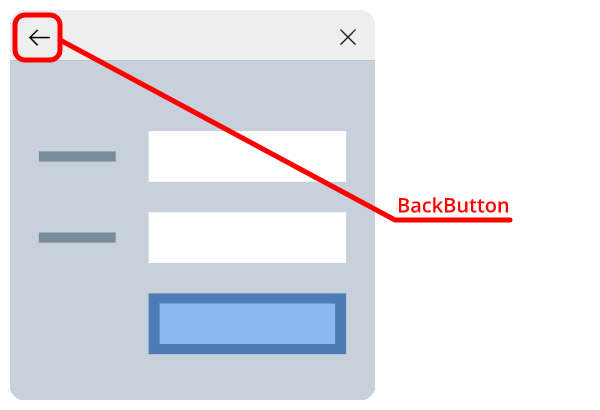

Button "Back" in the chat header

| Setting name | CSS property | Description |
|----------------------------------|--------------------------------|---------------------------------|
| top | [top](http://htmlbook.ru/css/top) | Top offset |
| left | [left](http://htmlbook.ru/css/left) | Left offset |
| right | [right](http://htmlbook.ru/css/right) | Right offset |
| width | [width](http://htmlbook.ru/css/width) | Button width |
| height | [height](http://htmlbook.ru/css/height) | Button height |
| backgroundSize | [background-size](http://htmlbook.ru/css/background-size) | Background image size |
| backgroundImage | [background-image](http://htmlbook.ru/css/background-image) | Background image path |
| backgroundImageHover | [background-image](http://htmlbook.ru/css/background-image) | Background image path (hover) |

#### Button

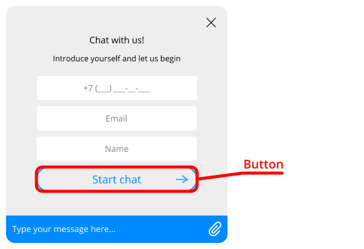

Buttons inside the forms.

| Setting name | CSS property | Description |
|----------------------------------|--------------------------------|---------------------------------|
| padding | [padding](http://htmlbook.ru/css/padding) | Padding area |
| maxHeight | [max-height](http://htmlbook.ru/css/max-height) | Maximum height |
| maxWidth | [max-width](http://htmlbook.ru/css/max-width) | Maximum width |
| backgroundColor | [background-color](http://htmlbook.ru/css/background-color) | Background color |
| backgroundImage | [background-image](http://htmlbook.ru/css/background-image) | Background image path |
| backgroundPosition | [background-position](http://htmlbook.ru/css/background-position) | background image position |
| color | [color](http://htmlbook.ru/css/color) | Text color |
| fontWeight | [font-weight](http://htmlbook.ru/css/font-weight) | Font weight |
| fontSize | [font-size](http://htmlbook.ru/css/font-size) | Font size |
| fontFamily | [font-family](http://htmlbook.ru/css/font-family) | Font family |
| borderRadius | [border-radius](http://htmlbook.ru/css/border-radius) | Border radius |
| borderWidth | [border-width](http://htmlbook.ru/css/border-width) | Border width |
| borderColor | [border-color](http://htmlbook.ru/css/border-color) | Border color |
| borderStyle | [border-style](http://htmlbook.ru/css/border-style) | Border style |
| margin | [margin](http://htmlbook.ru/css/margin) | Margin area |
| backgroundImageHover | [background-image](http://htmlbook.ru/css/background-image) | Background image path (hover) |
| borderColorHover | [border-color](http://htmlbook.ru/css/border-color) | Border color (hover) |
| fontSizeHover | [font-size](http://htmlbook.ru/css/font-size) | Font size (hover) |
| colorHover | [color](http://htmlbook.ru/css/color) | Font color (hover) |
| backgroundColorHover | [background-color](http://htmlbook.ru/css/background-color) | Background color (hover) |

#### Chat

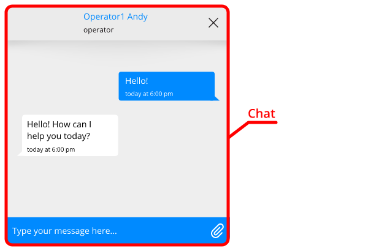

Common chat settings

| Setting name | CSS property | Description |
|----------------------------------|--------------------------------|---------------------------------|
| borderRadius | [border-radius](http://htmlbook.ru/css/border-radius) | Border radius |
| boxShadow | [box-shadow](http://htmlbook.ru/css/box-shadow) | Shadow |
| height | [height](http://htmlbook.ru/css/height) | Height |
| width | [width](http://htmlbook.ru/css/width) | Width |
| right | [right](http://htmlbook.ru/css/right) | Distance between the element's right edge and the page's right edge |
| bottom | [bottom](http://htmlbook.ru/css/bottom) | Distance between the element's bottom edge and the page's bottom edge |
| scrollbarWidth | [width](http://htmlbook.ru/css/width) | Scrollbar width |
| scrollbarBackgroundColor | [background-color](http://htmlbook.ru/css/background-color) | Scrollbar color |
| scrollbarBorderRadius | [border-radius](http://htmlbook.ru/css/border-radius) | Scrollbar border radius |

#### ChatBody

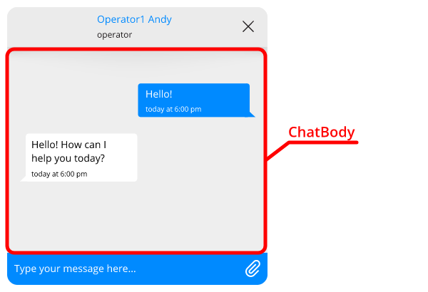

Chat section

| Setting name | CSS property | Description |
|----------------------------------|--------------------------------|---------------------------------|
| backgroundColor | [background-color](http://htmlbook.ru/css/background-color) | Background color |
| boxShadow | [box-shadow](http://htmlbook.ru/css/box-shadow) | Shadow |

#### ChatButton


Start button

| Setting name | CSS property | Description |
|----------------------------------|--------------------------------|---------------------------------|
| backgroundSize | [background-size](http://htmlbook.ru/css/background-size) | Button image size |
| backgroundImage | [background-image](http://htmlbook.ru/css/background-image) | Button image path |
| backgroundColor | [background-color](http://htmlbook.ru/css/background-color) | Button background color |
| borderRadius | [border-radius](http://htmlbook.ru/css/border-radius) | Button border radius |
| boxShadow | [box-shadow](http://htmlbook.ru/css/box-shadow) | Button shadow |
| height | [height](http://htmlbook.ru/css/height) | Button height |
| width | [width](http://htmlbook.ru/css/width) | Button width |
| right | [right](http://htmlbook.ru/css/right) | Distance between the element's right edge and the page's right edge |
| bottom | [bottom](http://htmlbook.ru/css/bottom) | Distance between the element's bottom edge and the page's bottom edge |

#### ChatHeader

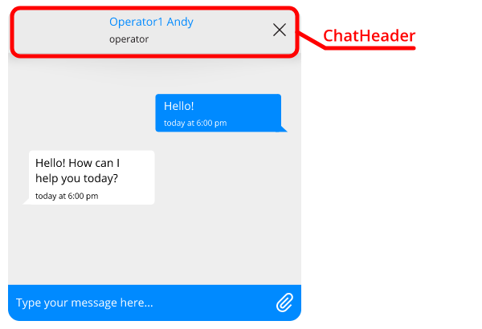

Chat header

| Setting name | CSS property | Description |
|----------------------------------|--------------------------------|---------------------------------|
| welcomeFontSize | [font-size](http://htmlbook.ru/css/font-size) | Font size "Welcome to chat!" |
| welcomeFontWeight | [font-weight](http://htmlbook.ru/css/font-weight) | Font weight "Welcome to chat!" |
| welcomeFontColor | [color](http://htmlbook.ru/css/color) | Font color "Welcome to chat!" |
| searchingFontSize | [font-size](http://htmlbook.ru/css/font-size) | Font size "Looking for operator" |
| searchingFontWeight | [font-weight](http://htmlbook.ru/css/font-weight) | Font weight "Looking for operator" |
| searchingColor | [color](http://htmlbook.ru/css/color) | Font color "Looking for operator" |
| spinnerBackgroundImage | [background-image](http://htmlbook.ru/css/background-image) | Preloader image |
| borderBottom | [border-bottom](http://htmlbook.ru/css/border-bottom) | Bottom border of the component |
| padding | [padding](http://htmlbook.ru/css/padding) | Padding area |
| align | [text-align](http://htmlbook.ru/css/text-align) | Text alignment |
| height | [height](http://htmlbook.ru/css/height) | Height |
| backgroundColor | [background-color](http://htmlbook.ru/css/background-color) | Background color |
| fontFamily | [font-family](http://htmlbook.ru/css/font-family) | Font family |
| fontSize | [font-size](http://htmlbook.ru/css/font-size) | Font size |
| color | [color](http://htmlbook.ru/css/color) | Text color |
| avatarWidth | [width](http://htmlbook.ru/css/width) | Avatar width |
| avatarHeight | [height](http://htmlbook.ru/css/height) | Avatar height |
| agentNameColor | [color](http://htmlbook.ru/css/color) | Agent name font color |
| agentNameFontSize | [font-size](http://htmlbook.ru/css/font-size) | Agent name font size |
| agentNameFontWeight | [font-weight](http://htmlbook.ru/css/font-weight) | Agent name font weight |
| agentNameMaxWidth | [max-width](http://htmlbook.ru/css/max-width) | Agent name maximum width |
| agentInfoColor | [color](http://htmlbook.ru/css/color) | Additional info font color |
| agentInfoFontSize | [font-size](http://htmlbook.ru/css/font-size) | Additional info font size |
| agentInfoFontWeight | [font-weight](http://htmlbook.ru/css/font-weight) | Additional info font weight |
| agentInfoMaxWidth | [max-width](http://htmlbook.ru/css/max-width) | Maximum width of additional info |

#### ChatInput

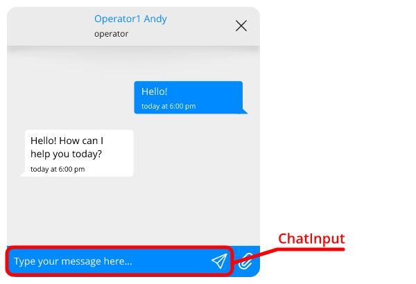

Message input field.

| Setting name | CSS property | Description |
|----------------------------------|--------------------------------|---------------------------------|
| submitButtonOpacity | [opacity](http://htmlbook.ru/css/opacity) | Submit button opacity |
| submitButtonDisplay | [display](http://htmlbook.ru/css/display) | Submit button display type |
| submitButtonRight | [right](http://htmlbook.ru/css/right) | Submit button right offset |
| submitButtonTop | [top](http://htmlbook.ru/css/top) | Submit button top offset |
| submitButtonBackgroundImage | [background-image](http://htmlbook.ru/css/background-image) | Submit button background image path |
| limiterMargin | [margin](http://htmlbook.ru/css/margin) | Container margin area |
| limiterWidth | [width](http://htmlbook.ru/css/width) | Container width |
| limiterMaxHeight | [max-height](http://htmlbook.ru/css/max-height) | Container maximum width |
| wrapperHeight | [height](http://htmlbook.ru/css/height) | Component height |
| wrapperBorderTop | [border-top](http://htmlbook.ru/css/border-top) | Component top border style |
| wrapperBorder | [border](http://htmlbook.ru/css/border) | Component border style |
| wrapperPadding | [padding](http://htmlbook.ru/css/padding) | Component padding area |
| wrapperBackgroundColor | [background-color](http://htmlbook.ru/css/background-color) | Component background color |
| placeholderColor | [color](http://htmlbook.ru/css/color) | Placeholder text color |
| backgroundColor | [background-color](http://htmlbook.ru/css/background-color) | Input field background color |
| color | [color](http://htmlbook.ru/css/color) | Input field text color |
| fontSize | [font-size](http://htmlbook.ru/css/font-size) | Font size |
| fontWeight | [font-weight](http://htmlbook.ru/css/font-weight) | Font weight |
| borderTopWidth | [border-top-width](http://htmlbook.ru/css/border-top-width) | Top border width |
| borderRightWidth | [border-right-width](http://htmlbook.ru/css/border-right-width) | Right border width |
| borderBottomWidth | [border-bottom-width](http://htmlbook.ru/css/border-bottom-width) | Bottom border width |
| borderLeftWidth | [border-left-width](http://htmlbook.ru/css/border-left-width) | Left border width |
| borderColor | [border-color](http://htmlbook.ru/css/border-color) | Border color |
| padding | [padding](http://htmlbook.ru/css/padding) | Text field padding area |

#### ChatInvite


Invitation bubble

| Setting name | CSS property | Description |
|----------------------------------|--------------------------------|---------------------------------|
| color | [color](http://htmlbook.ru/css/color) | Text color |
| fontFamily | [font-family](http://htmlbook.ru/css/font-family) | Font family |
| fontSize | [font-size](http://htmlbook.ru/css/font-size) | Font size |
| padding | [padding](http://htmlbook.ru/css/padding) | Padding area |
| maxWidth | [max-width](http://htmlbook.ru/css/max-width) | Maximum width |
| backgroundColor | [background-color](http://htmlbook.ru/css/background-color) | Bubble background color |
| filter | [filter](http://htmlbook.ru/css/filter) | Filter |
| height | [height](http://htmlbook.ru/css/height) | Height |
| width | [width](http://htmlbook.ru/css/width) | Width |
| right | [right](http://htmlbook.ru/css/right) | Distance between the element's right edge and the page's right edge |
| bottom | [bottom](http://htmlbook.ru/css/bottom) | Distance between the element's bottom edge and the page's bottom edge |
| buttonColor | [color](http://htmlbook.ru/css/color) | Close button foreground color |
| buttonBackgroundColor | [background-color](http://htmlbook.ru/css/background-color) | Close button background color |

#### ChatMessagesBadge

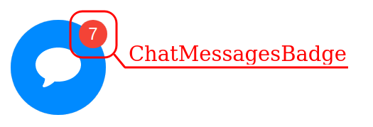

Chat button badge with new messages counter

| Setting name | CSS property | Description |
|----------------------------------|--------------------------------|---------------------------------|
| color | [color](http://htmlbook.ru/css/color) | Text color |
| fontFamily | [font-family](http://htmlbook.ru/css/font-family) | Font family |
| fontSize | [font-size](http://htmlbook.ru/css/font-size) | Font size |
| lineHeight | [line-height](http://htmlbook.ru/css/line-height) | Line height |
| backgroundColor | [background-color](http://htmlbook.ru/css/background-color) | Bubble background color |
| height | [height](http://htmlbook.ru/css/height) | Height |
| width | [width](http://htmlbook.ru/css/width) | Width |
| right | [right](http://htmlbook.ru/css/right) | Distance between the element's right edge and the page's right edge |
| bottom | [bottom](http://htmlbook.ru/css/bottom) | Distance between the element's bottom edge and the page's bottom edge |
| borderRadius | [border-radius](http://htmlbook.ru/css/border-radius) | Border radius |

#### ChatPoll

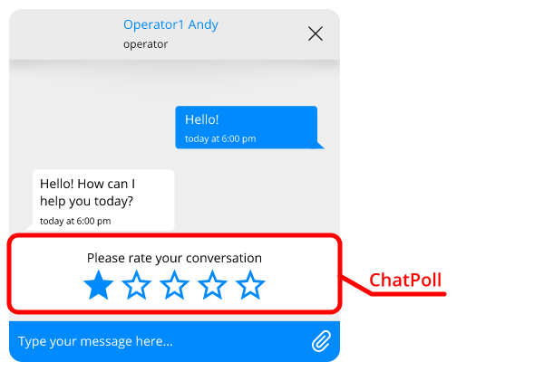

Poll

| Setting name | CSS property | Description |
|----------------------------------|--------------------------------|---------------------------------|
| starDisabledOutlineImage | [background-image](http://htmlbook.ru/css/background-image) | Outline disabled star image path |
| starOutlineImage | [background-image](http://htmlbook.ru/css/background-image) | Outline star image path |
| starFilledImage | [background-image](http://htmlbook.ru/css/background-image) | Filled star image path |
| starFilledRatedImage | [background-image](http://htmlbook.ru/css/background-image) | Filled star image path for result output |
| starWidth | [width](http://htmlbook.ru/css/width) | Star width |
| starHeight | [height](http://htmlbook.ru/css/height) | Star height |
| textMargin | [margin](http://htmlbook.ru/css/margin) | Question text margin area |
| color | [color](http://htmlbook.ru/css/color) | Question text font color |
| fontSize | [font-size](http://htmlbook.ru/css/font-size) | Question text font size |
| fontFamily | [font-family](http://htmlbook.ru/css/font-family) | Question text font family |
| fontWeight | [font-weight](http://htmlbook.ru/css/font-weight) | Question text font weight |
| thanksFontWeight | [font-weight](http://htmlbook.ru/css/font-weight) | Thanks text font weight |
| thanksColor | [color](http://htmlbook.ru/css/color) | Thanks text font color |
| thanksFontSize | [font-size](http://htmlbook.ru/css/font-size) | Thanks text font size |
| thanksFontFamily | [font-family](http://htmlbook.ru/css/font-family) | Thanks text font family |
| margin | [margin](http://htmlbook.ru/css/margin) | Margin area |
| backgroundColor | [background-color](http://htmlbook.ru/css/background-color) | Background color |

#### ChatWelcome

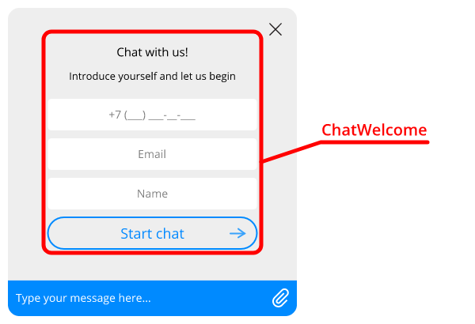

Welcome section

| Setting name | CSS property | Description |
|----------------------------------|--------------------------------|---------------------------------|
| width | [width](http://htmlbook.ru/css/width) | Width |
| maxWidth | [max-width](http://htmlbook.ru/css/max-width) | Maximum width |
| textAlign | [text-align](http://htmlbook.ru/css/text-align) | Text alignment |
| margin | [margin](http://htmlbook.ru/css/margin) | Form margin area |
| headerMargin | [margin](http://htmlbook.ru/css/margin) | Form header margin area |
| buttonMargin | [margin](http://htmlbook.ru/css/margin) | Button margin area |
| buttonFontSize | [font-size](http://htmlbook.ru/css/font-size) | Button font size |
| textColor | [color](http://htmlbook.ru/css/color) | Main text color |
| textFontSize | [font-size](http://htmlbook.ru/css/font-size) | Main text font size |
| textFontFamily | [font-family](http://htmlbook.ru/css/font-family) | Main text font family |
| textTextAlign | [text-align](http://htmlbook.ru/css/text-align) | Main text alignment |
| textMarginBottom | [margin-bottom](http://htmlbook.ru/css/margin-bottom) | Main text bottom margin |
| subtextColor | [color](http://htmlbook.ru/css/color) | Main text font |
| subtextFontSize | [font-size](http://htmlbook.ru/css/font-size) | Additional text color |
| subtextFontFamily | [font-family](http://htmlbook.ru/css/font-family) | Additional text font family |
| subtextTextAlign | [text-align](http://htmlbook.ru/css/text-align) | Additional text alignment |
| subtextMarginBottom | [margin-bottom](http://htmlbook.ru/css/margin-bottom) | Additional text bottom margin |
| greetTextColor | [color](http://htmlbook.ru/css/color) | Main welcome message text color |
| greetTextFontSize | [font-size](http://htmlbook.ru/css/font-size) | Main welcome message text font size |
| greetTextFontFamily | [font-family](http://htmlbook.ru/css/font-family) | Main welcome message text font family |
| greetTextTextAlign | [text-align](http://htmlbook.ru/css/text-align) | Main welcome message text alignment |
| greetTextMarginBottom | [margin-bottom](http://htmlbook.ru/css/margin-bottom) | Main welcome message text bottom margin |
| greetSubtextColor | [color](http://htmlbook.ru/css/color) | Additional welcome message text color |
| greetSubtextFontSize | [font-size](http://htmlbook.ru/css/font-size) | Additional welcome message text font size |
| greetSubtextFontFamily | [font-family](http://htmlbook.ru/css/font-family) | Additional welcome message text font family |
| greetSubtextTextAlign | [text-align](http://htmlbook.ru/css/text-align) | Additional welcome message text alignment |
| greetSubtextMarginBottom | [margin-bottom](http://htmlbook.ru/css/margin-bottom) | Additional welcome message text bottom margin |
| greetImageDisplay | [display](http://htmlbook.ru/css/display) | Welcome message image display type |
| greetImageMargin | [margin](http://htmlbook.ru/css/margin) | Welcome message image margin area |
| greetImageBackgroundImage | [background-image](http://htmlbook.ru/css/background-image) | Welcome message image path |
| greetImageWidth | [width](http://htmlbook.ru/css/width) | Welcome message image width |
| greetImageHeight | [height](http://htmlbook.ru/css/height) | Welcome message image height |
| feedbackPadding | [padding](http://htmlbook.ru/css/padding) | Message text padding area |
| feedbackTextAlign | [text-align](http://htmlbook.ru/css/text-align) | Message text align |
| feedbackFontWeight | [font-weight](http://htmlbook.ru/css/font-weight) | Message text font weight |
| feedbackColor | [color](http://htmlbook.ru/css/color) | Message text font color |
| feedbackFontSize | [font-size](http://htmlbook.ru/css/font-size) | Message text font size |
| feedbackFontFamily | [font-family](http://htmlbook.ru/css/font-family) | Message text font family |
| feedbackPlaceholderColor | [color](http://htmlbook.ru/css/color) | Message placeholder text color |
| feedbackMargin | [margin](http://htmlbook.ru/css/margin) | Message text margin area |
| feedbackBackgroundColor | [background-color](http://htmlbook.ru/css/background-color) | Message text background color |
| feedbackBorderRadius | [border-radius](http://htmlbook.ru/css/border-radius) | Message text border radius |
| feedbackBorderTopWidth | [border-top-width](http://htmlbook.ru/css/border-top-width) | Message text top border width |
| feedbackBorderRightWidth | [border-right-width](http://htmlbook.ru/css/border-right-width) | Message text right border width |
| feedbackBorderBottomWidth | [border-bottom-width](http://htmlbook.ru/css/border-bottom-width) | Message text bottom border width |
| feedbackBorderLeftWidth | [border-left-width](http://htmlbook.ru/css/border-left-width) | Message text left border width |
| feedbackBorderColor | [border-color](http://htmlbook.ru/css/border-color) | Message text border color |
| feedbackLimiterColor | [color](http://htmlbook.ru/css/color) | Message text limiter margin area |
| feedbackLimiterMargin | [margin](http://htmlbook.ru/css/margin) | Message text limiter margin area |

#### CloseButton

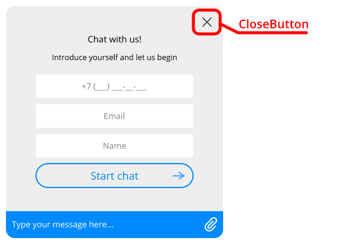

Chat closing button.

| Setting name | CSS property | Description |
|----------------------------------|--------------------------------|---------------------------------|
| top | [top](http://htmlbook.ru/css/top) | Button top offset |
| left | [left](http://htmlbook.ru/css/left) | Button left offset |
| right | [right](http://htmlbook.ru/css/right) | Button right offset |
| width | [width](http://htmlbook.ru/css/width) | Button width |
| height | [height](http://htmlbook.ru/css/height) | Button height |
| backgroundSize | [background-size](http://htmlbook.ru/css/background-size) | Background image size |
| backgroundImage | [background-image](http://htmlbook.ru/css/background-image) | Background image path |
| backgroundImageHover | [background-image](http://htmlbook.ru/css/background-image) | Background image path (hover) |

#### DateBar

Messages date

| Setting name | CSS property | Description |
|----------------------------------|--------------------------------|---------------------------------|
| color | [color](http://htmlbook.ru/css/color) | Font color |
| fontWeight | [font-weight](http://htmlbook.ru/css/font-weight) | Font weight |
| fontFamily | [font-family](http://htmlbook.ru/css/font-family) | Font family |
| fontSize | [font-size](http://htmlbook.ru/css/font-size) | Font size |
| padding | [padding](http://htmlbook.ru/css/padding) | Padding area |
| borderRadius | [border-radius](http://htmlbook.ru/css/border-radius) | Border radius |
| boxShadow | [box-shadow](http://htmlbook.ru/css/box-shadow) | Shadow |
| backgroundColor | [background-color](http://htmlbook.ru/css/background-color) | Background color |

#### Emoji


Emoji settings

| Setting name | CSS property | Description |
|----------------------------------|--------------------------------|---------------------------------|
| backgroundColor | [background-color](http://htmlbook.ru/css/background-color) | Background color |

#### EmojiButton

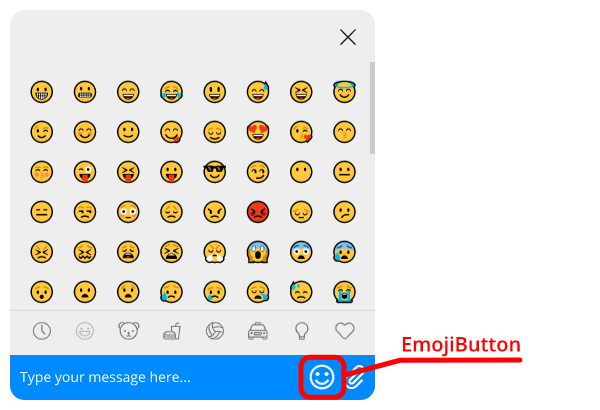

Emoji button settings

| Setting name | CSS property | Description |
|----------------------------------|--------------------------------|---------------------------------|
| opacity | [opacity](http://htmlbook.ru/css/opacity) | Opacity |
| borderColor | [border-color](http://htmlbook.ru/css/border-color) | Border color |
| borderLeftWidth | [border-left-width](http://htmlbook.ru/css/border-left-width) | Left border width |
| backgroundSize | [background-size](http://htmlbook.ru/css/background-size) | Button image size |
| height | [height](http://htmlbook.ru/css/height) | Button height |
| width | [width](http://htmlbook.ru/css/width) | Button width |
| top | [top](http://htmlbook.ru/css/top) | Button top offset |
| right | [right](http://htmlbook.ru/css/right) | Button right offset |
| left | [left](http://htmlbook.ru/css/left) | Button left offset |
| backgroundImage | [background-image](http://htmlbook.ru/css/background-image) | Background image path |
| backgroundImageHover | [background-image](http://htmlbook.ru/css/background-image) | Background image path (hover) |

#### InputText

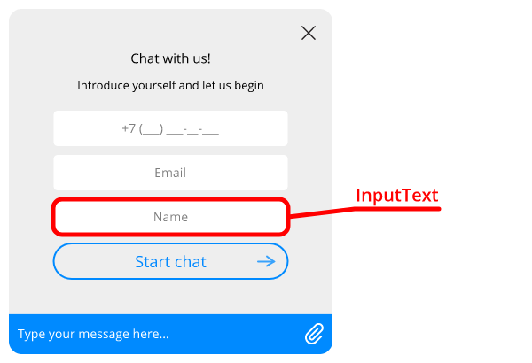

Text input fields inside the forms

| Setting name | CSS property | Description |
|----------------------------------|--------------------------------|---------------------------------|
| placeholderColor | [color](http://htmlbook.ru/css/color) | Placeholder text color |
| margin | [margin](http://htmlbook.ru/css/margin) | Margin area |
| padding | [padding](http://htmlbook.ru/css/padding) | Padding area |
| textAlign | [text-align](http://htmlbook.ru/css/text-align) | Text alignment |
| fontWeight | [font-weight](http://htmlbook.ru/css/font-weight) | Font weight |
| backgroundColor | [background-color](http://htmlbook.ru/css/background-color) | Background color |
| color | [color](http://htmlbook.ru/css/color) | Text color |
| fontSize | [font-size](http://htmlbook.ru/css/font-size) | Font size |
| fontFamily | [font-family](http://htmlbook.ru/css/font-family) | Font family |
| borderRadius | [border-radius](http://htmlbook.ru/css/border-radius) | Border radius |
| borderTopWidth | [border-top-width](http://htmlbook.ru/css/border-top-width) | Top border width |
| borderRightWidth | [border-right-width](http://htmlbook.ru/css/border-right-width) | Right border width |
| borderBottomWidth | [border-bottom-width](http://htmlbook.ru/css/border-bottom-width) | Bottom border width |
| borderLeftWidth | [border-left-width](http://htmlbook.ru/css/border-left-width) | Left border width |
| borderColor | [border-color](http://htmlbook.ru/css/border-color) | Border color |
| errorBackground | [background-color](http://htmlbook.ru/css/background-color) | Background color on error |

#### Link

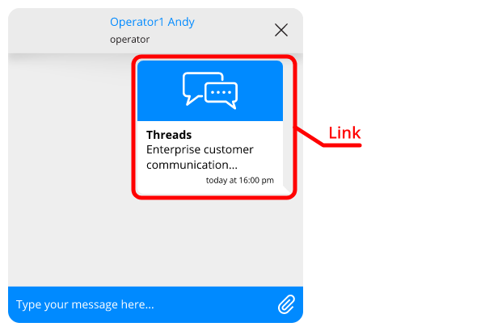

Web link preview

| Setting name | CSS property | Description |
|----------------------------------|--------------------------------|---------------------------------|
| containerType | - | Type of link preview display: "full" (default), "compact" |
| containerBorder | [border](http://htmlbook.ru/css/border) | Link preview border style |
| outMarginRight | [margin-right](http://htmlbook.ru/css/margin-right) | Right margin for preview of incoming message |
| inMarginLeft | [margin-left](http://htmlbook.ru/css/margin-left) | Left margin for preview of outgoing message |
| titleFontWeight | [font-weight](http://htmlbook.ru/css/font-weight) | Page title font weight |
| titleFontSize | [font-size](http://htmlbook.ru/css/font-size) | Page title font size |
| titleColor | [color](http://htmlbook.ru/css/color) | Page title font color |
| urlFontSize | [font-size](http://htmlbook.ru/css/font-size) | Link font size |
| urlColor | [color](http://htmlbook.ru/css/color) | Link font color |
| descriptionFontSize | [font-size](http://htmlbook.ru/css/font-size) | Description font size |
| descriptionColor | [color](http://htmlbook.ru/css/color) | Description font color |

#### MessageClient

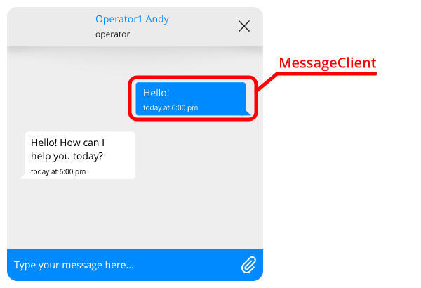

Outgoing message

| Setting name | CSS property | Description |
|----------------------------------|--------------------------------|---------------------------------|
| margin | [margin](http://htmlbook.ru/css/margin) | Margin area |
| color | [color](http://htmlbook.ru/css/color) | Text color |
| fontFamily | [font-family](http://htmlbook.ru/css/font-family) | Font family |
| fontSize | [font-size](http://htmlbook.ru/css/font-size) | Font size |
| backgroundColor | [background-color](http://htmlbook.ru/css/background-color) | Background color |
| borderTopLeftRadius | [border-top-left-radius](http://htmlbook.ru/css/border-top-left-radius) | Top left border radius |
| borderBottomLeftRadius | [border-bottom-left-radius](http://htmlbook.ru/css/border-bottom-left-radius) | Bottom left border radius |
| borderTopRightRadius | [border-top-right-radius](http://htmlbook.ru/css/border-top-right-radius) | Top right border radius |
| borderBottomRightRadius | [border-bottom-right-radius](http://htmlbook.ru/css/border-bottom-right-radius) | Bottom right border radius |
| pointerDisplay | [display](http://htmlbook.ru/css/display) | Pointer display type |
| marginTop | [margin-top](http://htmlbook.ru/css/margin-top) | Margin top |
| quoteColor | [color](http://htmlbook.ru/css/color) | Quote font color |
| quoteFontSize | [font-size](http://htmlbook.ru/css/font-size) | Quote font size |
| quoteBorderColor | [border-color](http://htmlbook.ru/css/border-color) | Quote border color |
| addQuoteImage | [background-image](http://htmlbook.ru/css/background-image) | Path to quote button image |
| attachmentImageWidth | [width](http://htmlbook.ru/css/width) | Attached image width |
| attachmentImageHeight | [height](http://htmlbook.ru/css/height) | Attached image height |
| attachmentImagePadding | [padding](http://htmlbook.ru/css/padding) | Padding area of message with attached image |
| attachmentImageInfoColor | [color](http://htmlbook.ru/css/color) | Attached image description font color |
| attachmentImageInfoFontSize | [font-size](http://htmlbook.ru/css/font-size) | Attached image description font size |
| statusIconWidth | [width](http://htmlbook.ru/css/width) | The width of the icon showing message reading status |
| statusIconHeight | [height](http://htmlbook.ru/css/height) | The heigth of the icon showing message reading status |
| statusIconColor | - | The color of the icon showing message reading status |
| linkFontFamily | [font-family](http://htmlbook.ru/css/font-family) | Link font family |
| linkFontSize | [font-size](http://htmlbook.ru/css/font-size) | Link font size |
| linkColor | [color](http://htmlbook.ru/css/color) | Link font color |
| linkFontWeight | [font-weight](http://htmlbook.ru/css/font-weight) | Link font weight |
| attachmentIcon | [background-image](http://htmlbook.ru/css/background-image) | Attachment icon |
| attachmentIconSize | [background-size](http://htmlbook.ru/css/background-size) | Attachment icon size |
| attachmentIconHover | [background-image](http://htmlbook.ru/css/background-image) | Attachment icon (hover) |

#### MessageOperator

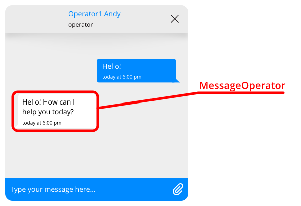

Incoming messages

| Setting name | CSS property | Description |
|----------------------------------|--------------------------------|---------------------------------|
| notificationColor | [color](http://htmlbook.ru/css/color) | Notification font color |
| notificationFontFamily | [font-family](http://htmlbook.ru/css/font-family) | Notification font family |
| notificationFontSize | [font-size](http://htmlbook.ru/css/font-size) | Notification font size |
| notificationJoinDisplay | [display](http://htmlbook.ru/css/display) | Display type of notification "Operator has joined" |
| notificationJoinBorderTop | [border-top](http://htmlbook.ru/css/border-top) | Top border of notification "Operator has joined" |
| notificationJoinBorderBottom | [border-bottom](http://htmlbook.ru/css/border-bottom) | Bottom border of notification "Operator has joined" |
| notificationJoinPadding | [padding](http://htmlbook.ru/css/padding) | Padding area of notification "Operator has joined" |
| notificationJoinMargin | [margin](http://htmlbook.ru/css/margin) | Margin area of notification "Operator has joined" |
| notificationJoinAvatarDisplay | [display](http://htmlbook.ru/css/display) | Display type of operator's avatar in the notification "Operator has joined" |
| notificationJoinAvatarWidth | [width](http://htmlbook.ru/css/width) | Width of operator's avatar in the notification "Operator has joined" |
| notificationJoinAvatarHeight | [height](http://htmlbook.ru/css/height) | Height of operator's avatar in the notification "Operator has joined" |
| notificationJoinNameDisplay | [display](http://htmlbook.ru/css/display) | Display type of operator's name in the notification "Operator has joined" |
| notificationJoinNameFontSize | [font-size](http://htmlbook.ru/css/font-size) | Font size of operator's name in the notification "Operator has joined" |
| notificationJoinNameFontWeight | [font-weight](http://htmlbook.ru/css/font-weight) | Font weight of operator's name in the notification "Operator has joined" |
| notificationJoinTextDisplay | [display](http://htmlbook.ru/css/display) | Display type of message in the notification "Operator has joined" |
| notificationJoinTextColor | [color](http://htmlbook.ru/css/color) | Text color of message in the notification "Operator has joined" |
| notificationJoinTextFontSize | [font-size](http://htmlbook.ru/css/font-size) | Font size of message in the notification "Operator has joined" |
| notificationJoinDateDisplay | [display](http://htmlbook.ru/css/display) | Display type of date in the notification "Operator has joined" |
| notificationJoinDateFontSize | [font-size](http://htmlbook.ru/css/font-size) | Font size of date in the notification "Operator has joined" |
| notificationJoinDateColor | [color](http://htmlbook.ru/css/color) | Text color of date in the notification "Operator has joined" |
| notificationLeftDisplay | [display](http://htmlbook.ru/css/display) | Display type of notification "Operator has left" |
| notificationLeftBorderTop | [border-top](http://htmlbook.ru/css/border-top) | Top border of notification "Operator has left" |
| notificationLeftBorderBottom | [border-bottom](http://htmlbook.ru/css/border-bottom) | Bottom border of notification "Operator has left" |
| notificationLeftPadding | [padding](http://htmlbook.ru/css/padding) | Padding area of notification "Operator has left" |
| notificationLeftMargin | [margin](http://htmlbook.ru/css/margin) | Margin area of notification "Operator has left" |
| notificationLeftAvatarDisplay | [display](http://htmlbook.ru/css/display) | Display type of operator's avatar in the notification "Operator has left" |
| notificationLeftAvatarWidth | [width](http://htmlbook.ru/css/width) | Width of operator's avatar in the notification "Operator has left" |
| notificationLeftAvatarHeight | [height](http://htmlbook.ru/css/height) | Height of operator's avatar in the notification "Operator has left" |
| notificationLeftNameDisplay | [display](http://htmlbook.ru/css/display) | Display type of operator's name in the notification "Operator has left" |
| notificationLeftNameFontSize | [font-size](http://htmlbook.ru/css/font-size) | Font size of operator's name in the notification "Operator has left" |
| notificationLeftNameFontWeight | [font-weight](http://htmlbook.ru/css/font-weight) | Font weight of operator's name in the notification "Operator has left" |
| notificationLeftTextDisplay | [display](http://htmlbook.ru/css/display) | Display type of message in the notification "Operator has left" |
| notificationLeftTextColor | [color](http://htmlbook.ru/css/color) | Text color of message in the notification "Operator has left" |
| notificationLeftTextFontSize | [font-size](http://htmlbook.ru/css/font-size) | Font size of message in the notification "Operator has left" |
| notificationLeftDateDisplay | [display](http://htmlbook.ru/css/display) | Display type of date in the notification "Operator has left" |
| notificationLeftDateFontSize | [font-size](http://htmlbook.ru/css/font-size) | Font size of date in the notification "Operator has left" |
| notificationLeftDateColor | [color](http://htmlbook.ru/css/color) | Text color of date in the notification "Operator has left" |
| margin | [margin](http://htmlbook.ru/css/margin) | Margin area |
| avatarDisplay | [display](http://htmlbook.ru/css/display) | Avatar display type |
| avatarImage | [background-image](http://htmlbook.ru/css/background-image) | Avatar default image path |
| avatarWidth | [width](http://htmlbook.ru/css/width) | Avatar width |
| avatarHeight | [height](http://htmlbook.ru/css/height) | Avatar height |
| avatarBottom | [bottom](http://htmlbook.ru/css/bottom) | Avatar bottom offset |
| maxWidth | [max-width](http://htmlbook.ru/css/max-width) | Maximum width |
| color | [color](http://htmlbook.ru/css/color) | Text color |
| fontFamily | [font-family](http://htmlbook.ru/css/font-family) | Font family |
| fontSize | [font-size](http://htmlbook.ru/css/font-size) | Font size |
| backgroundColor | [background-color](http://htmlbook.ru/css/background-color) | Background color |
| borderTopLeftRadius | [border-top-left-radius](http://htmlbook.ru/css/border-top-left-radius) | Top left border radius |
| borderBottomLeftRadius | [border-bottom-left-radius](http://htmlbook.ru/css/border-bottom-left-radius) | Bottom left border radius |
| borderTopRightRadius | [border-top-right-radius](http://htmlbook.ru/css/border-top-right-radius) | Top right border radius |
| borderBottomRightRadius | [border-bottom-right-radius](http://htmlbook.ru/css/border-bottom-right-radius) | Bottom right border radius |
| pointerType | - | Pointer type. Valid values: "1", "2" |
| pointerDisplay | [display](http://htmlbook.ru/css/display) | Pointer display type |
| marginTop | [margin-top](http://htmlbook.ru/css/margin-top) | Margin top |
| quoteColor | [color](http://htmlbook.ru/css/color) | Quote font color |
| quoteFontSize | [font-size](http://htmlbook.ru/css/font-size) | Quote font size |
| quoteBorderColor | [border-color](http://htmlbook.ru/css/border-color) | Quote border color |
| addQuoteImage | [background-image](http://htmlbook.ru/css/background-image) | Path to quote button image |
| attachmentImageType | - | Display type of attached image: "compact" (default), "full". |
| attachmentImageWidth | [width](http://htmlbook.ru/css/width) | Attached image width |
| attachmentImageHeight | [height](http://htmlbook.ru/css/height) | Attached image height |
| attachmentImagePadding | [padding](http://htmlbook.ru/css/padding) | Padding area of message with attached image |
| attachmentImageInfoColor | [color](http://htmlbook.ru/css/color) | Attached image description font color |
| attachmentImageInfoFontSize | [font-size](http://htmlbook.ru/css/font-size) | Attached image description font size |
| linkFontFamily | [font-family](http://htmlbook.ru/css/font-family) | Link font family |
| linkFontSize | [font-size](http://htmlbook.ru/css/font-size) | Link font size |
| linkColor | [color](http://htmlbook.ru/css/color) | Link font color |
| linkFontWeight | [font-weight](http://htmlbook.ru/css/font-weight) | Link font weight |
| attachmentIcon | [background-image](http://htmlbook.ru/css/background-image) | Attachment icon |
| attachmentIconSize | [background-size](http://htmlbook.ru/css/background-size) | Attachment icon size |
| attachmentIconHover | [background-image](http://htmlbook.ru/css/background-image) | Attachment icon (hover) |

#### MessageTime

Message time

| Setting name | CSS property | Description |
|----------------------------------|--------------------------------|---------------------------------|
| color | [color](http://htmlbook.ru/css/color) | Font color |
| fontWeight | [font-weight](http://htmlbook.ru/css/font-weight) | Font weight |
| fontFamily | [font-family](http://htmlbook.ru/css/font-family) | Font family |
| fontSize | [font-size](http://htmlbook.ru/css/font-size) | Font size |
| top | [top](http://htmlbook.ru/css/top) | Top offset |

#### Offline

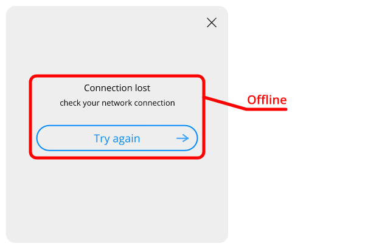

Connection error

| Setting name | CSS property | Description |
|----------------------------------|--------------------------------|---------------------------------|
| backgroundColor | [background-color](http://htmlbook.ru/css/background-color) | Background color |
| maxWidth | [max-width](http://htmlbook.ru/css/max-width) | Maximum width |
| textAlign | [text-align](http://htmlbook.ru/css/text-align) | Text alignment |
| textColor | [color](http://htmlbook.ru/css/color) | Main text color |
| textFontSize | [font-size](http://htmlbook.ru/css/font-size) | Main text font size |
| textFontFamily | [font-family](http://htmlbook.ru/css/font-family) | Main text font family |
| textFontWeight | [font-weight](http://htmlbook.ru/css/font-weight) | Main text font weight |
| subtextColor | [color](http://htmlbook.ru/css/color) | Additional text font color |
| subtextFontSize | [font-size](http://htmlbook.ru/css/font-size) | Additional text font size |
| subtextFontFamily | [font-family](http://htmlbook.ru/css/font-family) | Additional text font family |
| subtextFontWeight | [font-weight](http://htmlbook.ru/css/font-weight) | Additional text font weight |
| buttonMargin | [margin](http://htmlbook.ru/css/margin) | Button margin area |

#### Preloader

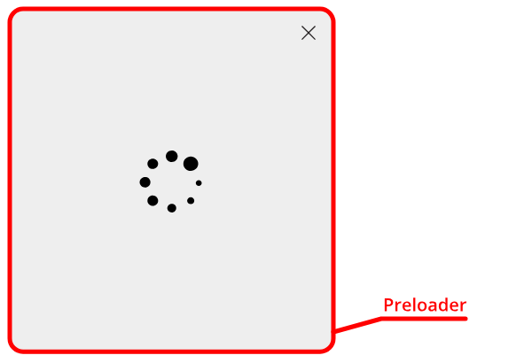

Preloading overlay to disable chat window

| Setting name | CSS property | Description |
|----------------------------------|--------------------------------|---------------------------------|
| backgroundColor | [background-color](http://htmlbook.ru/css/background-color) | Overlay background color |
| spinnerBackgroundImage | [background-image](http://htmlbook.ru/css/background-image) | Preloader image |

#### Preview

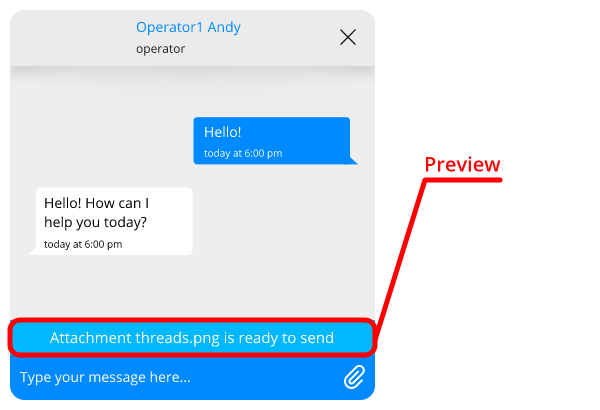

Attachments and quotes preview area

| Setting name | CSS property | Description |
|----------------------------------|--------------------------------|---------------------------------|
| padding | [padding](http://htmlbook.ru/css/padding) | Padding area |
| backgroundColor | [background-color](http://htmlbook.ru/css/background-color) | Background color |
| color | [color](http://htmlbook.ru/css/color) | Text color |
| fontSize | [font-size](http://htmlbook.ru/css/font-size) | Font size |
| fontFamily | [font-family](http://htmlbook.ru/css/font-family) | Font family |
| attachmentIcon | [background-image](http://htmlbook.ru/css/background-image) | Document attachment icon |
| buttonBackgroundImage | [background-image](http://htmlbook.ru/css/background-image) | Close button image path |
| buttonWidth | [width](http://htmlbook.ru/css/width) | Close button width |
| buttonHeight | [height](http://htmlbook.ru/css/height) | Close button height |
| quotedMessageBorderLeft | [border-left](http://htmlbook.ru/css/border-left) | The left border of the quoted message |
| quotedMessageBorderRight | [border-right](http://htmlbook.ru/css/border-right) | The right border of the quoted message |
| quotedMessageBorderTop | [border-top](http://htmlbook.ru/css/border-top) | The top border of the quoted message |
| quotedMessageBorderBottom | [border-bottom](http://htmlbook.ru/css/border-bottom) | The bottom border of the quoted message |
| quotedMessagePadding | [padding](http://htmlbook.ru/css/padding) | Padding area of the quoted message |
| quotedMessageWidth | [width](http://htmlbook.ru/css/width) | Quoted message wrapper width |
| quotedMessageMargin | [margin](http://htmlbook.ru/css/margin) | Quoted message wrapper margin area |
| quotedMessageFontFamily | [font-family](http://htmlbook.ru/css/font-family) | Quoted message font family |
| quotedMessageColor | [color](http://htmlbook.ru/css/color) | Quoted message font color |
| quotedMessageFontSize | [font-size](http://htmlbook.ru/css/font-size) | Quoted message font size |
| quotedMessageFontWeight | [font-weight](http://htmlbook.ru/css/font-weight) | Quoted message font weight |
| linkFontFamily | [font-family](http://htmlbook.ru/css/font-family) | Link font family |
| linkFontSize | [font-size](http://htmlbook.ru/css/font-size) | Link font size |
| linkColor | [color](http://htmlbook.ru/css/color) | Link font color |
| linkFontWeight | [font-weight](http://htmlbook.ru/css/font-weight) | Link font weight |

#### QuickQuestions


Panel of quick answers

| Setting name | CSS property | Description |
|----------------------------------|--------------------------------|---------------------------------|
| direction | [direction](http://htmlbook.ru/css/direction) | Direction. Valid values: "row" (default value), "column" |
| containerBackground | [background](http://htmlbook.ru/css/background) | Container background color |
| buttonFontWeight | [font-weight](http://htmlbook.ru/css/font-weight) | Button font weight |
| buttonFontSize | [font-size](http://htmlbook.ru/css/font-size) | Button font size |
| buttonFontFamily | [font-family](http://htmlbook.ru/css/font-family) | Button font family |
| buttonBorderRadius | [border-radius](http://htmlbook.ru/css/border-radius) | Button border radius |
| buttonMargin | [margin](http://htmlbook.ru/css/margin) | Button margin area |
| buttonBorder | [border](http://htmlbook.ru/css/border) | Button border style |
| buttonBackground | [background](http://htmlbook.ru/css/background) | Button background color |
| buttonColor | [color](http://htmlbook.ru/css/color) | Button text color |
| buttonBorderHover | [border](http://htmlbook.ru/css/border) | Button border style (hover) |
| buttonBackgroundHover | [background](http://htmlbook.ru/css/background) | Button background color (hover) |
| buttonColorHover | [color](http://htmlbook.ru/css/color) | Button text color (hover) |
| buttonBorderActive | [border](http://htmlbook.ru/css/border) | Button border style (pressed) |
| buttonBackgroundActive | [background](http://htmlbook.ru/css/background) | Button background color (pressed) |
| buttonColorActive | [color](http://htmlbook.ru/css/color) | Button text color (pressed) |

#### ScrollButton

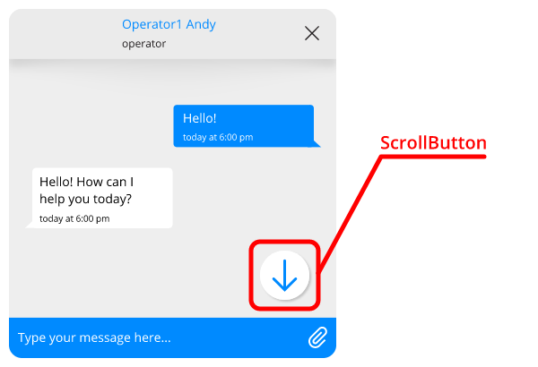

Button to scroll message history

| Setting name | CSS property | Description |
|----------------------------------|--------------------------------|---------------------------------|
| marginTop | [margin-top](http://htmlbook.ru/css/margin-top) | Top margin |
| width | [width](http://htmlbook.ru/css/width) | Button width |
| height | [height](http://htmlbook.ru/css/height) | Button height |
| backgroundSize | [background-size](http://htmlbook.ru/css/background-size) | Button image size |
| backgroundImage | [background-image](http://htmlbook.ru/css/background-image) | Button image path |
| backgroundColor | [background-color](http://htmlbook.ru/css/background-color) | Button background color |

#### ScrollButtonBadge

Unread messages counter of button to scroll message history

| Setting name | CSS property | Description |
|----------------------------------|--------------------------------|---------------------------------|
| color | [color](http://htmlbook.ru/css/color) | Text color |
| fontFamily | [font-family](http://htmlbook.ru/css/font-family) | Font family |
| fontSize | [font-size](http://htmlbook.ru/css/font-size) | Font size |
| backgroundColor | [background-color](http://htmlbook.ru/css/background-color) | Bubble background color |
| height | [height](http://htmlbook.ru/css/height) | Height |
| width | [width](http://htmlbook.ru/css/width) | Width |
| top | [top](http://htmlbook.ru/css/top) | Positioning relative to the top edge of the scroll button |

#### SocialLinks

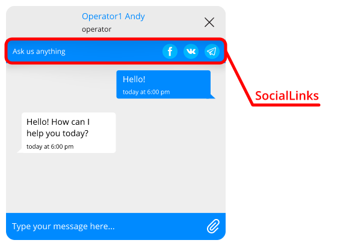

Social link panel

| Setting name | CSS property | Description |
|----------------------------------|--------------------------------|---------------------------------|
| padding | [padding](http://htmlbook.ru/css/padding) | Section padding area |
| backgroundColor | [background-color](http://htmlbook.ru/css/background-color) | Section background color |
| fontFamily | [font-family](http://htmlbook.ru/css/font-family) | Font family |
| fontSize | [font-size](http://htmlbook.ru/css/font-size) | Font size |
| color | [color](http://htmlbook.ru/css/color) | Text color |
| cellWidth | [width](http://htmlbook.ru/css/width) | Width of button cell |
| buttonSize | [width](http://htmlbook.ru/css/width) | Button zize |
| buttonBackgroundColor | [background-color](http://htmlbook.ru/css/background-color) | Button background color |
| buttonImageSize | [background-size](http://htmlbook.ru/css/background-size) | Button image size |

#### Typing


Notification about operator typing

| Setting name | CSS property | Description |
|----------------------------------|--------------------------------|---------------------------------|
| avatarDisplay | [display](http://htmlbook.ru/css/display) | Avatar display type |
| color | [color](http://htmlbook.ru/css/color) | Font color |
| opacity | [opacity](http://htmlbook.ru/css/opacity) | Text opacity |
| fontSize | [font-size](http://htmlbook.ru/css/font-size) | Font size |
| containerPadding | [padding](http://htmlbook.ru/css/padding) | Block padding area |
| containerBackground | [background](http://htmlbook.ru/css/background) | Block background color |
| containerWidth | [width](http://htmlbook.ru/css/width) | Block Width |
| borderTopLeftRadius | [border-top-left-radius](http://htmlbook.ru/css/border-top-left-radius) | Top left border radius |
| borderBottomLeftRadius | [border-bottom-left-radius](http://htmlbook.ru/css/border-bottom-left-radius) | Bottom left border radius |
| borderTopRightRadius | [border-top-right-radius](http://htmlbook.ru/css/border-top-right-radius) | Top right border radius |
| borderBottomRightRadius | [border-bottom-right-radius](http://htmlbook.ru/css/border-bottom-right-radius) | Bottom right border radius |
| animationPreset | - | Animation type. Valid values: 1, 2 |

#### WebView

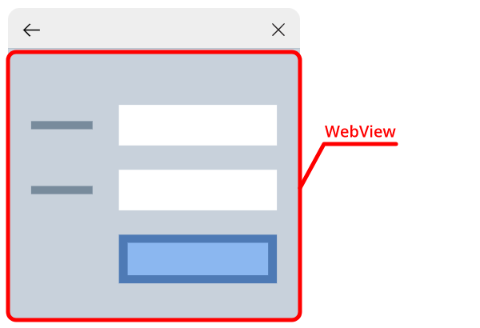

Container to show the content of the external resource

| Setting name | CSS property | Description |
|----------------------------------|--------------------------------|---------------------------------|
| backgroundColor | [background-color](http://htmlbook.ru/css/background-color) | Background color |
| errorTextColor | [color](http://htmlbook.ru/css/color) | Error message font color |
| errorTextFontSize | [font-size](http://htmlbook.ru/css/font-size) | Error message font size |
| errorTextFontFamily | [font-family](http://htmlbook.ru/css/font-family) | Error message font family |
| errorTextTextAlign | [text-align](http://htmlbook.ru/css/text-align) | Error message text alignment |


