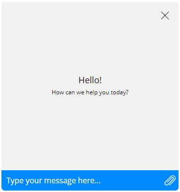
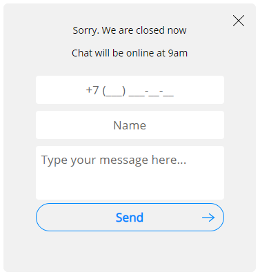
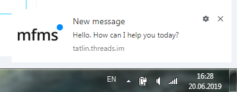

#### Table of contents
* [**filename**](#filename)
* [**style**](#style)
* [**webchat/locale**](#webchatlocale)
* [**webchat/locales**](#webchatlocales)
* [**webchat/connectDelay**](#webchatconnectdelay)
* [**webchat/wsReconnectType**](#webchatwsreconnecttype)
* [**webchat/wsMaxRetries**](#webchatwsmaxretries)
* [**webchat/wsRetryTimeoutMs**](#webchatwsretrytimeoutms)
* [**webchat/allowedTypes**](#webchatallowedtypes)
* [**webchat/package, webchat/uid**](#webchatpackage-webchatuid)
* [**webchat/hideWelcome**](#webchathidewelcome)
* [**webchat/maximizeOnInit**](#webchatmaximizeoninit)
* [**webchat/disableInputOnQuickReplies**](#webchatdisableinputonquickreplies)
* [**webchat/welcomeForm**](#webchatwelcomeform)
* [**webchat/appMarker**](#webchatappmarker)
* [**webchat/clientId**](#webchatclientid)
* [**webchat/clientData**](#webchatclientdata)
* [**webchat/signature**](#webchatsignature)
* [**webchat/checkURL**](#webchatcheckurl)
* [**webchat/datastore**](#webchatdatastore)
* [**webchat/schedule**](#webchatschedule)
* [**webchat/schedule/interval**](#webchatscheduleinterval)
* [**webchat/inactivityForm**](#webchatinactivityform)
* [**webchat/activePages**](#webchatactivepages)
* [**webchat/history**](#webchathistory)
* [**webchat/cloudStorage**](#webchatcloudstorage)
* [**webchat/webNotification**](#webchatwebnotification)
* [**webchat/webNotification/title**](#webchatwebnotificationtitle)
* [**webchat/webNotification/icon**](#webchatwebnotificationicon)
* [**webchat/disableQuoting**](#webchatdisablequoting)
* [**webchat/enableGeoRequest**](#webchatenablegeorequest)
* [**webchat/enableIpRequest**](#webchatenableiprequest)
* [**webchat/disableWebNotification**](#webchatdisablewebnotification)
* [**webchat/disableFormatSimpleMessages**](#webchatdisableformatsimplemessages)
* [**webchat/chatHeader**](#webchatchatheader)
* [**webchat/chatHeader/hideSearchText**](#webchatchatheaderhidesearchtext)
* [**webchat/chatHeader/showOrganisationUnit**](#webchatchatheadershoworganisationunit)
* [**webchat/isContainerHidden**](#webchatiscontainerhidden)
* [**webchat/socialLinks**](#webchatsociallinks)
* [**webchat/socialLinks/visible**](#webchatsociallinksvisible)
* [**webchat/socialLinks/buttons**](#webchatsociallinksbuttons)
* [**webchat/unauthorizedHistory**](#webchatunauthorizedhistory)
* [**webchat/opengraph**](#webchatopengraph)
* [**webchat/apiUrl**](#webchatapiurl)

Attribute | Description | Default value
--- | --- | ---
### **filename**

Widget core (Javascript-file)

*По умолчанию:*
```
"../../threadswidget-3.29.0.min.js"
```

---

### **style**

Path to the CSS-file with widget styles

*По умолчанию:*
```
"../../threadswidget-3.29.0.min.css"
```

---

### **webchat/locale**

Widget language. Available values: `ru`, `en`, `id`, `az`

*По умолчанию:*
```
"ru"
```

---

### **webchat/locales**

Widget language. Available values: "ru", "en"

*По умолчанию:*
```
locales": {}
```

---

### **webchat/connectDelay**

The time from the initialization of the widget to the establishment of the WebSocket connection (ms).

*По умолчанию:*
```
0
```

---

### **webchat/wsReconnectType**

A way to reconnect WebSocket in case of loss of connection. 0 - (default) reconnect automatically. 1 - reconnect when a user sends a message

*По умолчанию:*
```
0
```

---

### **webchat/wsMaxRetries**

Try to reconnect WebSocket this many times

*По умолчанию:*
```
30
```

---

### **webchat/wsRetryTimeoutMs**

WebSocket reconnect timeout in ms

*По умолчанию:*
```
none
```

---

### **webchat/allowedTypes**

Array of allowed file types

*По умолчанию:*
```
none
```

---

### **webchat/package, webchat/uid**

Settings of Threads API

*По умолчанию:*
```
none
```

---

### **webchat/hideWelcome**

Hide welcome block

*По умолчанию:*
```
false
```

---

### **webchat/maximizeOnInit**

Maximize chat when the page opens.

*По умолчанию:*
```
false
```

---

### **webchat/disableInputOnQuickReplies**

Block chat input when receiving buttons.

*По умолчанию:*
```
false
```

---

### **webchat/welcomeForm**

Welcome [form](Configuration-of-appearance-theme#chatwelcome) settings. You can set available fields: phone, email, name. By default form contains all this parameters. Visibility (`visible`) and mandatory fill (`required`) are specified for each field.<br>You can set a template for the phone. Use X to determine the position of the digits. For example: set the template "+7 (XXX) XXX-XX-XX" for line "+7 (\_\_\_) \_\_\_\-\_\_\-\_\_". By default, no template is specified. Only digits are allowed.<br>Errors are [highlighted](Configuration-of-appearance-theme#inputtext)

*По умолчанию:*
```
{
    "pre": {
        "text": true,
        "notice": true
    },
    "phone": {
        "visible": true,
        "required": false,
        "mask": "+7 (XXX) XXX-XX-XX"
    },
    "email": {
        "visible": true,
        "required": true
    },
    "name": {
        "visible": true,
        "required": false
    }
}
```

---

### **webchat/appMarker**

Application ID, used if case of several channel applications.

*По умолчанию:*
```
none
```

---

### **webchat/clientId**

Name of the windows property containing client ID of the authorized client.

*По умолчанию:*
```
"clientId"
```

---

### **webchat/clientData**

Name of the `window` property containing client data of the authorized client

*По умолчанию:*
```
"clientData"
```

---

### **webchat/signature**

Name of the `window` property containing signature.

*По умолчанию:*
```
"signature"
```

---

### **webchat/checkURL**

Address of the service checking network connection.

*По умолчанию:*
```
none
```

---

### **webchat/datastore**

Address of the file storage

*По умолчанию:*
```
none
```

---

### **webchat/schedule**

Chat availability settings.

*По умолчанию:*
```
{
    "interval": 1000
}
```

---

### **webchat/schedule/interval**

Update interval (ms).

*По умолчанию:*
```
1000
```

---

### **webchat/inactivityForm**

Settings of the form shown when the chat is offline. You can add standard fields: phone, email, name. Also, you can change the text above the feedback form and the confirmation message.

*По умолчанию:*
```
{
    "phone": true,
    "email": true,
    "name": true
}
```

---

### **webchat/activePages**

Array of webpage addresses where the chat is enabled.

*По умолчанию:*
```
[]
```

---

### **webchat/history**

Settings of the message history loading interface.

*По умолчанию:*
```
{
    "url": "FIX_ME",
    "count": 20
}
```

---

### **webchat/cloudStorage**

Settings of the file storage interface.

*По умолчанию:*
```
none
```

---

### **webchat/webNotification**

Notification settings *(image 3)*

*По умолчанию:*
```
{
    "title": "",
    "icon": ""
}
```

---

### **webchat/webNotification/title**

Custom title of notifications.

*По умолчанию:*
```
none
```

---

### **webchat/webNotification/icon**

Custom notification button in the format base64 (jpg/png).

*По умолчанию:*
```
none
```

---

### **webchat/disableQuoting**

Disable message quoting (`true`/`false`)

*По умолчанию:*
```
false
```

---

### **webchat/enableGeoRequest**

Location request setting (`true`/`false`).

*По умолчанию:*
```
false
```

---

### **webchat/enableIpRequest**

Ip request setting (`true`/`false`).

*По умолчанию:*
```
true
```

---

### **webchat/disableWebNotification**

Notification request setting (`true`/`false`).

*По умолчанию:*
```
false
```

---

### **webchat/disableFormatSimpleMessages**

Disable markdown parsing and formatting for messages (exclude bot markdown messages) (`true`/`false`).

*По умолчанию:*
```
false
```

---

### **webchat/chatHeader**

Widget header

*По умолчанию:*
```
{
    "showOrganisationUnit": false,
    "hideSearchText": false
}
```

---

### **webchat/chatHeader/hideSearchText**

Hide seraching indication.

*По умолчанию:*
```
false
```

---

### **webchat/chatHeader/showOrganisationUnit**

Show organization unit in chat header

*По умолчанию:*
```
false
```

---

### **webchat/isContainerHidden**

Start chat button visibility settings. See "Visibility Settings".

*По умолчанию:*
```
false
```

---

### **webchat/socialLinks**

Configuration of [special link block](Настройка-темы-оформления#sociallinks)

*По умолчанию:*
```
{
    "visible": false,
    "buttons": [
        {
            "url": "https://vk.com/",
            "tooltip": "VK",
            "image": "http://..."
        }
    ]
}
```

---

### **webchat/socialLinks/visible**

Enable / disable special link block (`true`/`false`)

*По умолчанию:*
```
false
```

---

### **webchat/socialLinks/buttons**

Buttons of special link panel. The collection of objects containing three properties: url (link), tooltip (hover tip) and image (the link to image or [data: URL](http://base64.resampled.ru/) or image)

*По умолчанию:*
```
[
    {
        "url": "https://vk.com/",
        "tooltip": "VK",
        "image": "http://..."
    }
]
```

---

### **webchat/unauthorizedHistory**

Setting for history of messages for unauthorized zone. согласно [официальной документации](https://developer.mozilla.org/en-US/docs/Web/HTTP/Headers/Set-Cookie)

*По умолчанию:*
```
{
    "url": "URL_TO_DATASTORE",
    "count": 20,
    "enable": false,
    "cookie": {
        "Max-Age": 3600
    }
}
```

---

### **webchat/opengraph**

Setting for OpenGraph protocol, that get preview of inline links in message text

*По умолчанию:*
```
<URL_TO_DATASTORE>/opengraph?href=
```

---

### **webchat/apiUrl**

Address for API requests

*По умолчанию:*
```
<URL_TO_DATASTORE>
```

---




Img. 1. Message after sending contact data



Img. 2. Out-of-hours feedback form



Img. 3. Browser notification
