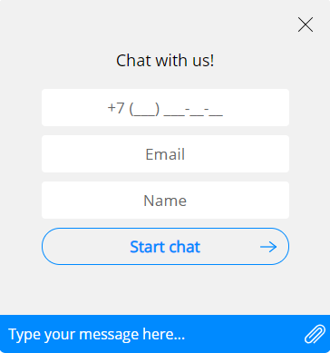

#### Table of contents
* [Widget code](#widget-code)
* [Settings file](#settings-file)
* [Widget configuration](#widget-configuration)
	* [Connection to external Threads API and the datastore](#connection-to-external-threads-api-and-the-datastore)
	* [Authorized and unauthorized zones](#authorized-and-unauthorized-zones)
* [Chat launch](#chat-launch)

### Widget code

Add the following code before the closing tag `</body>` to enable chat widget on the webpage:

```html
<!-- BEGIN THREADS {literal} -->
<script type="text/javascript">!function(configurationFile,e){"use strict";configurationFile=configurationFile||"/settings.json";var t=window,a=document;t.ThreadsWidget={isDummy:!0},["hideInvite","version","commitHash","showChat","hideChat","onHideChat","onScenarios","onLoad"].forEach(function(e){t.ThreadsWidget[e]=function(a){var n,i,o;n=e,i=a,o=setInterval(function(){t.ThreadsWidget&&!t.ThreadsWidget.isDummy&&(clearInterval(o),t.ThreadsWidget[n]&&t.ThreadsWidget[n](i))},100)}});var n,i=(n=new XMLHttpRequest,function(e,t,a,i){n.onreadystatechange=function(){if(4===n.readyState)if(200===this.status)a(n.response);else{if("function"!=typeof i)throw new Error(n.response);i(n)}},n.open(e,t),n.send()});function o(t){t.webchat&&(t.webchat.filename=t.filename),t.style&&(t.webchat.style=t.style),e&&"string"==typeof e&&(t.webchat.currentLocale=e),e&&"object"==typeof e&&(e.locale&&"string"==typeof e.locale&&(t.webchat.currentLocale=e.locale),e.unavailable&&"boolean"==typeof e.unavailable&&(t.webchat.isUnavailableOnStart=e.unavailable));try{sessionStorage.setItem("__threadsWidget",JSON.stringify(t.webchat))}catch(e){window.__threadsWidget=JSON.stringify(t.webchat)}if(t.filename){var n=a.createElement("script");n.type="text/javascript",n.async=!0,n.src=t.filename;var i=a.getElementsByTagName("script")[0];i?i.parentNode.insertBefore(n,i):a.body.appendChild(n)}else console&&console.error("Invalid bundle")}function s(){i("GET",configurationFile+"?rnd="+Math.random(),function(e){var t=JSON.parse(e);o(t)})}"complete"===a.readyState?s():t.attachEvent?t.attachEvent("onload",s):t.addEventListener("load",s,!1)}("settings.json",{});</script>
<!-- {/literal} END THREADS -->
```

### Settings file

Copy file `settings.json` to the chat directory. 

**IMPORTANT!**
The path to the settings file `settings.json` is set at the end of the initialization script:

```js
... ("settings.json")
```  

Use the absolute path from the root of your website. Example:

```js
("/your/path/to/settings.json")
```  

If it necessary, you can set additional parameters during initial initialization.

```js
("/your/path/to/settings.json", {
  locale: "en",
  unavailable: true
})
```  
* `locale` - locale language
* `unavailable` - widget availability

If `unavailable` param is set true. After loading the chat page, the chat will be hidden unless the client had an active thread

### Widget configuration

Chat settings are set in the provided file `settings.json`. The file contains file storage connection data, appearance theme settings, connection settings and API keys.

#### Connection to external Threads API and the datastore

The settings are unique for each connection. In the examples Threads SDK they are set as `"FIX_ME"` and should be edited before the launch. The parameters:
       
* `webchat/package = <application_package>`
* `webchat/uid = <application_uid>`
* `webchat/pushserver = <push server URL>`
* `webchat/websocket = <push server websocket URL>`
* `webchat/datastore = <datastore URL>`
* `webchat/history/url = <datastore history URL>`

You will get the values of these parameters from the deployment manager. 

**Note** In case of on-premise deployment of Threads parameters  `webchat/datastore` and `webchat/history/url` depend on the address of the installed Threads Datastore.

#### Authorized and unauthorized zones

The chat widget can be in one of the modes:

1. **Guest mode**. The user session exists within the current browser tab. The chat history is linked to the tab, remains same at page refresh but is cleared when the tab is closed.
2. **Authorized mode**. The mode can be activated for the authorized website user by passing the unique user identifier to the chat to create a link "Threads client" - "website user". The session of authorized user is not linked to the browser tab - the user will see the chat history on any tab with the opened webchat. Set the parameter `clientId` in the `settings.json` file in the global Javascript-object [window](https://developer.mozilla.org/ru/docs/Web/API/Window) to pass the unique identifier of authorized user. Do this before the chat initialization. The string in the `settings.json` can be as follows:

```json
"clientId": "clientId",
```

So if you decided to place the unique user identifier in the property of the object `window`, which you decided to name `clientId` (as in the example above), insert the following string before the initialization code.

```js
window.clientId = "user identifier";
```

You can pass additional client data in the same way (in JSON format). To do so set the parameter `clientData` in the global Javascript-object `window`. The string can be as follows:

```json
"clientData": "clientData",
```

If you set the property `clientData` as in the example above, insert the following string before the initialization code

```js
window.clientData = <JSON data>;
```

clientData - json string, where you can pass additional custom user data. The parameters which will be displayed as client general information: name, phone, email. Example:
```
{
  "name": "Name Surname",
  "phone": "+7-999-999-99-99",
  "email": "e@mail.com",
  "customField":"customValue"
}
```

**NOTE**: Examples in the SDK contain all necessary settings.

### Chat launch

When the settings are saved, open the webpage with the chat in your browser. You will see the chat button in the right bottom corner. Upon clicking it the start chat window is displayed (img. 1).



Img. 1. Start chat window
