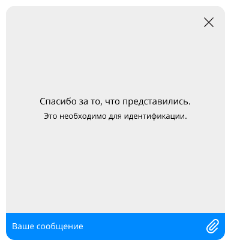
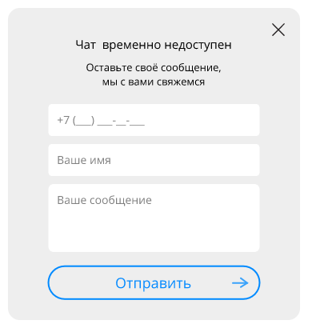
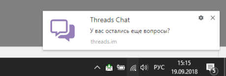

#### Содержание
* [**Файлы чата**](#user-content-Файлы-чата)
	* [**filename**](#filename)
	* [**style**](#style)
* [**Подключение к сервисам Чат-платформы**](#user-content-Подключение-к-сервисам-Чат-платформы)
	* [**webchat/package, webchat/uid**](#webchatpackage-webchatuid)
	* [**webchat/appMarker**](#webchatappmarker)
	* [**webchat/checkURL**](#webchatcheckurl)
	* [**webchat/datastore**](#webchatdatastore)
	* [**webchat/history**](#webchathistory)
	* [**webchat/unauthorizedHistory**](#webchatunauthorizedhistory)
	* [**webchat/opengraph**](#webchatopengraph)
	* [**webchat/apiUrl**](#webchatapiurl)
* [**Настройки WS**](#user-content-Настройки-WS)
	* [**webchat/websocket**](#webchatwebsocket)
	* [**webchat/connectDelay**](#webchatconnectdelay)
	* [**webchat/wsReconnectType**](#webchatwsreconnecttype)
	* [**webchat/wsMaxRetries**](#webchatwsmaxretries)
	* [**webchat/wsRetryTimeoutMs**](#webchatwsretrytimeoutms)
* [**Настройки доступности Чата**](#user-content-Настройки-доступности-Чата)
	* [**webchat/schedule**](#webchatschedule)
	* [**webchat/schedule/interval**](#webchatscheduleinterval)
	* [**webchat/activePages**](#webchatactivepages)
	* [**webchat/isContainerHidden**](#webchatiscontainerhidden)
* [**Настройки поведения Чата**](#user-content-Настройки-поведения-Чата)
	* [**webchat/allowedTypes**](#webchatallowedtypes)
	* [**webchat/maximizeOnInit**](#webchatmaximizeoninit)
	* [**webchat/disableInputOnQuickReplies**](#webchatdisableinputonquickreplies)
	* [**webchat/disableQuoting**](#webchatdisablequoting)
	* [**webchat/disableFormatSimpleMessages**](#webchatdisableformatsimplemessages)
* [**Локализация**](#user-content-Локализация)
	* [**webchat/locale**](#webchatlocale)
	* [**webchat/locales**](#webchatlocales)
* [**Настройки шапки Чата**](#user-content-Настройки-шапки-Чата)
	* [**webchat/chatHeader**](#webchatchatheader)
	* [**webchat/chatHeader/hideSearchText**](#webchatchatheaderhidesearchtext)
	* [**webchat/chatHeader/showOrganisationUnit**](#webchatchatheadershoworganisationunit)
* [**Настройки приветственной и формы обратной связи**](#user-content-Настройки-приветственной-и-формы-обратной-связи)
	* [**webchat/hideWelcome**](#webchathidewelcome)
	* [**webchat/welcomeForm**](#webchatwelcomeform)
	* [**webchat/inactivityForm**](#webchatinactivityform)
* [**Данные клиента**](#user-content-Данные-клиента)
	* [**webchat/clientId**](#webchatclientid)
	* [**webchat/clientData**](#webchatclientdata)
	* [**webchat/signature**](#webchatsignature)
* [**Настройки определения местоположения клиента**](#user-content-Настройки-определения-местоположения-клиента)
	* [**webchat/enableGeoRequest**](#webchatenablegeorequest)
	* [**webchat/enableIpRequest**](#webchatenableiprequest)
* [**Настройки Web-нотификаций и Push-нотификаций**](#user-content-Настройки-Web-нотификаций-и-Push-нотификаций)
	* [**webchat/webNotification**](#webchatwebnotification)
	* [**webchat/webNotification/title**](#webchatwebnotificationtitle)
	* [**webchat/webNotification/icon**](#webchatwebnotificationicon)
	* [**webchat/disableWebNotification**](#webchatdisablewebnotification)
	* [**webchat/pushNotification**](#webchatpushnotification)
* [**Настройки блока социальных ссылок**](#user-content-Настройки-блока-социальных-ссылок)
	* [**webchat/socialLinks**](#webchatsociallinks)
	* [**webchat/socialLinks/visible**](#webchatsociallinksvisible)
	* [**webchat/socialLinks/buttons**](#webchatsociallinksbuttons)


### **Файлы чата**

#### **filename**

Ядро виджета Чата (Javascript-файл)

*По умолчанию:*
```
"../../threadswidget-3.29.3.min.js"
```

---

#### **style**

Путь к файлу с CSS-стилями Чата

*По умолчанию:*
```
"../../threadswidget-3.29.3.min.css"
```

---


### **Подключение к сервисам Чат-платформы**

#### **webchat/package, webchat/uid**

Настройки интеграции с Threads API

*По умолчанию:*
```
отсутствует
```

---

#### **webchat/appMarker**

Идентификатор приложения, используется для работы с несколькими приложениями в рамках одного канала.

*По умолчанию:*
```
отсутствует
```

---

#### **webchat/checkURL**

Адрес сервиса проверки доступности сети и push-платформы.

*По умолчанию:*
```
отсутствует
```

---

#### **webchat/datastore**

Адрес файлового хранилища

*По умолчанию:*
```
отсутствует
```

---

#### **webchat/history**

Настройки интерфейса подгрузки истории сообщений.

*По умолчанию:*
```
{
    "url": "FIX_ME",
    "count": 20
}
```

---

#### **webchat/unauthorizedHistory**

Настройка подгрузки истории сообщений, для неавторизованной зоны. url - адрес сервера для получения истори.<br>count - количество подгружаемых сообщений за одно обращение к серверу<br>enable: true/false включение/отключение режима хранения истории.<br>cookie: объект настройки хранения идентификатора клиента, для получения истории сообщений. Ключ по умолчанию Max-Age - время хранения. Так же доступны другие параметры хранения, согласно [официальной документации](https://developer.mozilla.org/en-US/docs/Web/HTTP/Headers/Set-Cookie)

*По умолчанию:*
```
{
    "url": "URL_TO_DATASTORE",
    "count": 20,
    "enable": false,
    "cookie": {
        "Max-Age": 3600
    }
}
```

---

#### **webchat/opengraph**

Настройка протокола OpenGraph, для получения превью при вставке ссылок в тексте сообщения

*По умолчанию:*
```
<URL_TO_DATASTORE>/opengraph?href=
```

---

#### **webchat/apiUrl**

Настройка адреса для API запросов

*По умолчанию:*
```
<URL_TO_DATASTORE>
```

---


### **Настройки WS**

#### **webchat/websocket**

Адрес websocket сервера

*По умолчанию:*
```
отсутствует
```

---

#### **webchat/connectDelay**

Время от момента инициализации Чата до установки WebSocket-соединения (мс).

*По умолчанию:*
```
0
```

---

#### **webchat/wsReconnectType**

Способ переподключения WebSocket при потере подключения. 0 - (по умолчанию) переподключаться автоматически. 1 - переподключаться при отправке сообщения пользователем

*По умолчанию:*
```
0
```

---

#### **webchat/wsMaxRetries**

Количество попыток переподключения WebSocket

*По умолчанию:*
```
30
```

---

#### **webchat/wsRetryTimeoutMs**

Начальное время между попытками переподключения WebSocket (мс). Каждая новая попытка увеличивает предыдущее время вдвое

*По умолчанию:*
```
отсутствует
```

---


### **Настройки доступности Чата**

#### **webchat/schedule**

Настройки доступности Чата.

*По умолчанию:*
```
{
    "interval": 1000
}
```

---

#### **webchat/schedule/interval**

Частота (в миллисекундах) с которой в интерфейсе происходит отображение изменений настройки "Режим работы чата" (настройка выполняется в АРМ Администратора). Отображение изменений будет происходить не чаще одного раза в указанный период, даже если в течение этого периода изменение настройки "Режим работы чата" произойдет много раз - все промежуточные события будут проигнорированы.

*По умолчанию:*
```
1000
```

---

#### **webchat/activePages**

Массив адресов страниц, на которых разрешен виджет Чата

*По умолчанию:*
```
[]
```

---

#### **webchat/isContainerHidden**

Управление видимостью стартовой кнопки чата. Подробности по управлению видимостью главного окна чата см. раздел “Управление видимостью виджета”

*По умолчанию:*
```
false
```

---


### **Настройки поведения Чата**

#### **webchat/allowedTypes**

Массив расширений файлов, разрешенных к загрузке

*По умолчанию:*
```
отсутствует
```

---

#### **webchat/maximizeOnInit**

Настройка, позволяющая автоматически разворачивать окно Чата при первой инициализации приложения. Следующие запуски Чата будут игнорировать эту настройку (будет использоваться последнее известное состояние). Данная опция работает только при использовании [стандартной стартовой кнопки](Настройка-темы-оформления#chatbutton), для этого параметр `isContainerHidden` (см. ниже) должен иметь значение `false`

*По умолчанию:*
```
false
```

---

#### **webchat/disableInputOnQuickReplies**

Установка этой настройки в значение `true` блокирует отправку сообщений при получении сообщения с быстрыми ответами

*По умолчанию:*
```
false
```

---

#### **webchat/disableQuoting**

Настройка запрещающая цитирование сообщений (`true`/`false`)

*По умолчанию:*
```
false
```

---

#### **webchat/disableFormatSimpleMessages**

Отключение форматирование для сообщений (все, кроме сообщений бота содержащих markdown) (`true`/`false`).

*По умолчанию:*
```
false
```

---


### **Локализация**

#### **webchat/locale**

Локаль виджета. Доступные варианты: `ru`, `en`, `id`, `az`

*По умолчанию:*
```
"ru"
```

---

#### **webchat/locales**

Перепоределение [локализационных текстов](Настройка-языковой-локализации)

*По умолчанию:*
```
locales": {}
```

---


### **Настройки шапки Чата**

#### **webchat/chatHeader**

Настройка [шапки Чата](Настройка-темы-оформления#chatheader)

*По умолчанию:*
```
{
    "showOrganisationUnit": false,
    "hideSearchText": false
}
```

---

#### **webchat/chatHeader/hideSearchText**

Настройка, отключающая отображение текста в шапке Чата, выводимого при поиске оператора.

*По умолчанию:*
```
false
```

---

#### **webchat/chatHeader/showOrganisationUnit**

Настройка, включающая отображение подразделения подключившегося оператора в шапке Чата

*По умолчанию:*
```
false
```

---


### **Настройки приветственной и формы обратной связи**

#### **webchat/hideWelcome**

Настройка, позволяющая отключить показ [блока приветствия](Настройка-темы-оформления#chatwelcome)

*По умолчанию:*
```
false
```

---

#### **webchat/welcomeForm**

Настройки [контактной](Настройка-темы-оформления#chatwelcome) формы в блоке приветствия. Видимость блока приветствия (предложения представиться) настраиватеся с помощью параметров `pre.text` и `pre.notice`.<br>Для формы доступно использование любого набора полей из имеющихся: телефон, email, имя клиента. При отсутствии настройки форма содержит полный набор этих параметров. Для каждого поля задается отображение (`visible`) и обязательность заполнения (`required`).<br>Для телефона можно задать маску. Для определения позиции цифр используется латинский символ X. Например: строка "+7 (XXX) XXX-XX-XX" задает маску "+7 (\_\_\_) \_\_\_\-\_\_\-\_\_". По умолчанию маска не задана, для номера телефона допускается ввод только цифр.<br>Ошибки заполнения полей [подсвечиваются](Настройка-темы-оформления#inputtext)

*По умолчанию:*
```
{
    "pre": {
        "text": true,
        "notice": true
    },
    "phone": {
        "visible": true,
        "required": false,
        "mask": "+7 (XXX) XXX-XX-XX"
    },
    "email": {
        "visible": true,
        "required": true
    },
    "name": {
        "visible": true,
        "required": false
    }
}
```

---

#### **webchat/inactivityForm**

Настройки формы, отображаемой в режиме недоступности Чата *(рис. 2)*. Имеется возможность создать свой набор полей из имеющихся (телефон, электропочта, имя клиента). Также, в этой секции можно изменить текст выводимый над формой и после отправки формы.

*По умолчанию:*
```
{
    "phone": true,
    "email": true,
    "name": true
}
```

---


### **Данные клиента**

#### **webchat/clientId**

Имя свойства объекта `window` в котором ожидается идентификатор авторизованного пользователя

*По умолчанию:*
```
"clientId"
```

---

#### **webchat/clientData**

Имя свойства объекта `window` в котором ожидается дополнительная информация о клиенте

*По умолчанию:*
```
"clientData"
```

---

#### **webchat/signature**

Имя свойства объекта `window` в котором ожидается цифровая подпись идентификатора авторизованного пользователя

*По умолчанию:*
```
"signature"
```

---


### **Настройки определения местоположения клиента**

#### **webchat/enableGeoRequest**

Настройка включения запрос местоположения (`true`/`false`).

*По умолчанию:*
```
false
```

---

#### **webchat/enableIpRequest**

Настройка включения запрос ip адреса (`true`/`false`).

*По умолчанию:*
```
true
```

---


### **Настройки Web-нотификаций и Push-нотификаций**

#### **webchat/webNotification**

Настройки нотификаций *(рис. 3)*

*По умолчанию:*
```
{
    "title": "",
    "icon": ""
}
```

---

#### **webchat/webNotification/title**

Заголовок нотификаций

*По умолчанию:*
```
отсутствует
```

---

#### **webchat/webNotification/icon**

Иконка нотификации в формате base64 (jpg/png).

*По умолчанию:*
```
отсутствует
```

---

#### **webchat/disableWebNotification**

Настройка для отправки нотификаций (`true`/`false`).

*По умолчанию:*
```
false
```

---

#### **webchat/pushNotification**

Настройка push уведомлений. Для включения уведомлений необходимо выставить `enable: true`, и заполнить раздел `firebaseConfig` данными своего проекта в [Firebase](https://console.firebase.google.com/u/0/)

*По умолчанию:*
```
{
    "enable": "false",
    "firebaseConfig": {}
}
```

---


### **Настройки блока социальных ссылок**

#### **webchat/socialLinks**

Настройка [блока социальных ссылок](Настройка-темы-оформления#sociallinks)

*По умолчанию:*
```
{
    "visible": false,
    "buttons": [
        {
            "url": "https://vk.com/",
            "tooltip": "VK",
            "image": "http://..."
        }
    ]
}
```

---

#### **webchat/socialLinks/visible**

Включение / отключение блока социальных ссылок (`true`/`false`)

*По умолчанию:*
```
false
```

---

#### **webchat/socialLinks/buttons**

Кнопки панели социальных ссылок. Коллекция объектов, каждый из которых содержит три свойства: `url` (ссылка), `tooltip` (подсказка при наведении) и `image` (ссылка на изображение или [data: URL](http://base64.resampled.ru/) изображения)

*По умолчанию:*
```
[
    {
        "url": "https://vk.com/",
        "tooltip": "VK",
        "image": "http://..."
    }
]
```

---




Рис. 1. Сообщение после отправки формы ввода контактных данных



Рис. 2. Форма, отображаемая в режиме недоступности Чата



Рис. 3. Браузерная нотификация
