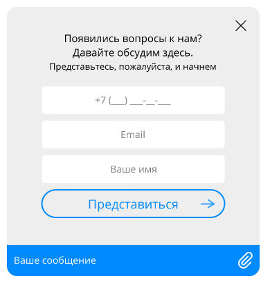

#### Содержание
* [Подключение виджета](#подключение-виджета)
* [Подключение файла настроек](#подключение-файла-настроек)
* [Настройка виджета](#настройка-виджета)
	* [Параметры подключения к внешнему API Threads и файловому хранилищу](#параметры-подключения-к-внешнему-api-threads-и-файловому-хранилищу)
	* [Авторизованная и неавторизованная зоны](#авторизованная-и-неавторизованная-зоны)
* [Запуск Чата](#запуск-чата)

### Подключение виджета 

Для установки виджета Чата на странице, где он будет отображаться, необходимо перед закрывающим тегом `</body>` добавить следующий инициализационный код:

```html
<!-- BEGIN THREADS {literal} -->
<script type="text/javascript">!function(configurationFile,e){"use strict";configurationFile=configurationFile||"/settings.json";var t=window,a=document;t.ThreadsWidget={isDummy:!0},["hideInvite","version","commitHash","showChat","hideChat","onHideChat","onScenarios","onLoad"].forEach(function(e){t.ThreadsWidget[e]=function(a){var n,i,o;n=e,i=a,o=setInterval(function(){t.ThreadsWidget&&!t.ThreadsWidget.isDummy&&(clearInterval(o),t.ThreadsWidget[n]&&t.ThreadsWidget[n](i))},100)}});var n,i=(n=new XMLHttpRequest,function(e,t,a,i){n.onreadystatechange=function(){if(4===n.readyState)if(200===this.status)a(n.response);else{if("function"!=typeof i)throw new Error(n.response);i(n)}},n.open(e,t),n.send()});function o(t){t.webchat&&(t.webchat.filename=t.filename),t.style&&(t.webchat.style=t.style),e&&"string"==typeof e&&(t.webchat.currentLocale=e),e&&"object"==typeof e&&(e.locale&&"string"==typeof e.locale&&(t.webchat.currentLocale=e.locale),e.unavailable&&"boolean"==typeof e.unavailable&&(t.webchat.isUnavailableOnStart=e.unavailable));try{sessionStorage.setItem("__threadsWidget",JSON.stringify(t.webchat))}catch(e){window.__threadsWidget=JSON.stringify(t.webchat)}if(t.filename){var n=a.createElement("script");n.type="text/javascript",n.async=!0,n.src=t.filename;var i=a.getElementsByTagName("script")[0];i?i.parentNode.insertBefore(n,i):a.body.appendChild(n)}else console&&console.error("Invalid bundle")}function s(){i("GET",configurationFile+"?rnd="+Math.random(),function(e){var t=JSON.parse(e);o(t)})}"complete"===a.readyState?s():t.attachEvent?t.attachEvent("onload",s):t.addEventListener("load",s,!1)}("settings.json",{});</script>
<!-- {/literal} END THREADS -->
```

### Подключение файла настроек

Необходимо скопировать файл `settings.json` в тот же каталог, где расположен Чат. 

**Важно!**
В самом конце скрипта инициализации задается путь к файлу настроек `settings.json`:

```js
... ("settings.json")
```  

Обязательно установите в качестве значения этого параметра абсолютный путь к файлу настроек от корня вашего сайта. Пример:

```js
("/your/path/to/settings.json")
```  

Если необходимо можно задать дпополнительные параметры при начальной инициализации.

```js
("/your/path/to/settings.json", {
  locale: "en",
  unavailable: true
})
```  
* `locale` - язык локализации
* `unavailable` - недоступность чата

При установке параметра `unavailable`, после загрузки страницы с чатом, чат будет скрыт кроме случаев когда у клиента был активный тред


### Настройка виджета

Настройки Чата хранятся в поставляемом файле `settings.json`. В нем содержится информация по подключению к файловому хранилищу, настройки темы оформления, настройки соединений и ключи для работы с внешним API Threads.

#### Параметры подключения к внешнему API Threads и файловому хранилищу

Эти настройки уникальны для каждого нового подключения. В примерах Threads SDK они установлены в значение `"FIX_ME"` и перед началом эксплуатации их необходимо отредактировать. К таким настройкам относятся:
       
* `webchat/package = <application_package>`
* `webchat/uid = <application_uid>`
* `webchat/pushserver = <push server URL>`
* `webchat/websocket = <push server websocket URL>`
* `webchat/datastore = <datastore URL>`
* `webchat/history/url = <datastore history URL>`
* `webchat/unauthorizedHistory/url = <datastore unauthorized history URL>`


Значения этих параметров вы получите от менеджера, ответственного за подключение. 

**Примечание** В случае развертывания Threads Datastore по модели on-premise (в контуре заказчика) параметры `webchat/datastore` и `webchat/history/url` будут зависить от адреса, по которому будет доступен установленный Threads Datastore.

#### Авторизованная и неавторизованная зоны

Виджет Чата может находиться в одном из двух состояний:

1. **Гостевой режим**. Время существования сессии пользователя определяется настройками, которые указаны в `settings.json`. `webchat/unauthorizedHistory`. Пример таких настроек: 
```
{
  "url": "https://url.to.datastore.com/history/unauthorized",
  "count": 20,
  "enable": true,
  "cookie": {"Max-Age": 15552000}
}
```
Где `url` - адрес сервера для получения истории (получите у вашего аккаунт-менеджера),
`count` - количество загружаемых сообщений за одно обращение к серверу  (запрос выполняется при загрузке виджета и при выполнении пользователем скролла вверх в чате);
`enable` - включение/выключение функции хранения истории;
`Max-Age` - время хранения истории для посетителя сайта в секундах.

Идентификатор сессии хранится в cookie, параметры хранения задаются в объекте `webchat/unauthorizedHistory/cookie`, где ключ соответствует спецификациям директив cookie.

2. **Авторизованный режим**. Этот режим можно задействовать для авторизованого пользователя сайта, передав в Чат идентификатор, уникальный для каждого пользователя - для создания связи "клиент в АРМ"-"пользователь сайта". Сессия такого пользователя не привязана к текущей вкладке - авторизованный на сайте пользователь сможет получить историю переписки в любой вкладке где будет открыт сайт с чатом. Для передачи в Чат уникального идентификатора авторизованного пользователя, нужно создать в глобальном Javascript-объекте [window](https://developer.mozilla.org/ru/docs/Web/API/Window) свойство, имя которого задается в `settings.json` как значение параметра `clientId`. Сделать это нужно до кода инициализации Чата. Строка в `settings.json`, в самом просто виде, может выглядеть так:

```json
"clientId": "clientId",
```

Т.е., если вы решили поместить уникальный идентификатор пользователя в свойство объекта `window`, которое вы решили назвать `clientId`, как в случае выше, то перед кодом инициализации следует вставить строку

```js
window.clientId = "идентификатор_пользователя";
```

Таким же образом имеется возможность передать дополнительные клиентские данные (в формате JSON). Для этого установить в глобальном Javascript-объекте `window` свойство, имя которого задается в `settings.json` как значение параметра `clientData`. Нужная строка может выглядеть так:

```json
"clientData": "clientData",
```

Т.е., если имя свойства - `clientData`, как в случае выше, то перед кодом инициализации следует вставить строку

```js
window.clientData = <данные в формате JSON>;
```

clientData - json строка, в которой можно передать кастомные параметры пользователя. Параметры которые будут отображены в общей информации о клиенте: name, phone, email. Пример:
```
{
  "name": "Name Surname",
  "phone": "+7-999-999-99-99",
  "email": "e@mail.com",
  "customField":"customValue"
}
```

**Примечание**: Примеры в SDK содержат все необходимые настройки.

### Запуск Чата

После сохранения изменений, откройте страницу с Чатом в браузере. В нижнем правом углу браузера 
появится кнопка для открытия Чата. При нажатии на нее загрузится стартовое окно Чата (рис. 1).



Рис. 1. Стартовое окно Чата
