#### Содержание
* [Структура раздела webchat.theme файла конфигурации settings.json](#структура-раздела-webchattheme-файла-конфигурации-settingsjson)
* [Структура секции `theme`](#структура-секции-theme)
* [Простой способ темизации](#простой-способ-темизации)
	* [Тема "mfms"](#тема-mfms)
	* [Тема "threadsim"](#тема-threadsim)
	* [Тема "halcyon"](#тема-halcyon)
	* [Тема "adaptive"](#тема-adaptive)
* [Настройка внешнего вида компонентов](#настройка-внешнего-вида-компонентов)
	* [Global](#global)
	* [AttachmentButton](#attachmentbutton)
	* [BackButton](#backbutton)
	* [Button](#button)
	* [Chat](#chat)
	* [ChatBody](#chatbody)
	* [ChatButton](#chatbutton)
	* [ChatHeader](#chatheader)
	* [ChatInput](#chatinput)
	* [ChatInvite](#chatinvite)
	* [ChatMessagesBadge](#chatmessagesbadge)
	* [ChatPoll](#chatpoll)
	* [ChatWelcome](#chatwelcome)
	* [CloseButton](#closebutton)
	* [DateBar](#datebar)
	* [Emoji](#emoji)
	* [EmojiButton](#emojibutton)
	* [InputText](#inputtext)
	* [Link](#link)
	* [MessageClient](#messageclient)
	* [MessageOperator](#messageoperator)
	* [MessageTime](#messagetime)
	* [Offline](#offline)
	* [Preloader](#preloader)
	* [Preview](#preview)
	* [QuickQuestions](#quickquestions)
	* [ScrollButton](#scrollbutton)
	* [ScrollButtonBadge](#scrollbuttonbadge)
	* [SocialLinks](#sociallinks)
	* [Typing](#typing)
	* [WebView](#webview)

### Структура раздела webchat.theme файла конфигурации settings.json

Настройки темизации находятся в секции `theme` конфигурационного файла `settings.json`. Структура секции выглядит следующим образом:

```json
{
    "skin": {
       "name": "mfms",
       "colorMain": "#008aff",
       "colorSecond": "#05b8ff",
       "colorLines": "#dee4e9",
       "colorSubText": "#6e6e6e",
       "colorText": "#000",
       "colorBackground": "#fff", 
       "width": "366px",
       "height": "420px"
     },
    "fonts": [
        "/font1.css",    
        "https://example.com/font2.css"    
    ],
    "desktop": {
        "Global": {},
        "component1": {},
        "component2": {},
        "componentN": {}
    },
    "mobile": {
        "Global": {},
        "component1": {},
        "component2": {},
        "componentN": {}
    },
    "mobileS": {
        "Global": {},
        "component1": {},
        "component2": {},
        "componentN": {}
    },
    "mobileM": {
        "Global": {},
        "component1": {},
        "component2": {},
        "componentN": {}
    },
    "mobileL": {
        "Global": {},
        "component1": {},
        "component2": {},
        "componentN": {}
    },
    "tablet": {
        "Global": {},
        "component1": {},
        "component2": {},
        "componentN": {}
    }
}
```

**Внимание!**

Если не стоит задача детальной настройки внешнего вида Чата и будет достаточно изменить цвета и размер виджета, чтобы он соответствовал внешнему виду сайта, то рекоммендуется воспользоваться [упрощенным способом темизации](#простой-способ-темизации).

### Структура секции `theme`

* `skin` - настройки упрощенной темизации. Секция позволяет выбрать одну из предустановленных тем и переопределить базовые настройки отображения темы. Не является обязательной. См. [Простой способ темизации](#простой-способ-темизации)
* `fonts` - массив ссылок на CSS-файлы веб-шрифтов. Это могут быть ссылки на внешние источники (например, Google Fonts), ссылки на файлы на том же домене (абсолютные или отнросительные) или внедренные данные в формате `data: URI`. Не является обязательной.
* `desktop` - секция служит для стилизации виджета для отображения в настольных браузерах. Наследует стили секции `skin` и позволяет переопределить их. Не является обязательной.
* `mobile` - секция служит для стилизации виджета для отображения в мобильных браузерах. Наследует стили секции `desktop` и позволяет переопределить их. Не является обязательной.
* `mobileS` - стили этой секции будут применяться для мобильных устройств с шириной экрана до 320px. Наследует стили секции `mobile` и позволяет переопределить их. Не является обязательной.
* `mobileM` - стили этой секции будут применяться для мобильных устройств с шириной экрана от 321px до 375px. Наследует стили секции `mobile` и позволяет переопределить их. Не является обязательной.
* `mobileL` - стили этой секции будут применяться для мобильных устройств с шириной экрана от 376px до 425px. Наследует стили секции `mobile` и позволяет переопределить их. Не является обязательной.
* `tablet` - стили этой секции будут применяться для мобильных устройств с шириной экрана от 426px до 1023px. Наследует стили секции `mobile` и позволяет переопределить их. Не является обязательной.

**Внимание!**

Для удобного использования виджета на мобильных устройствах в секции `mobile` включена кнопка отправки, по умолчанию - белого цвета.
Рекомендуем настроить кнопку для соответствия вашему гайдлайну (компонент [ChatInput](#chatinput)).

### Простой способ темизации

Настройки темизации находятся в секции `theme` в подсекции `skin`. Пример секции выглядит следующим образом:

```json
{
    "skin": {
       "name": "mfms",
       "colorMain": "#008aff",
       "colorSecond": "#05b8ff",
       "colorLines": "#dee4e9",
       "colorSubText": "#6e6e6e",
       "colorText": "#000",
       "colorBackground": "#fff",
       "width": "366px",
       "height": "420px"
     }
}
```

Секция `skin` содержит следующие поля (любое из этих полей не является обязательным, более детальное описание полей доступно ниже для каждой темы):

Поле | Описание | Значение по умолчанию
--- | --- | ---
`name` | Название темы оформления. Список доступных тем:<br>`mfms`, `threadsim`, `halcyon`, `adaptive` | `"threadsim"`
`width` | Ширина виджета | `"366px"`
`height` | Высота виджета | `"420px"`
`colorMain` | Основной базовый цвет | `"#008aff"`
`colorSecond` | Дополнительный базовый цвет | `"#05b8ff"`
`colorLines` | Цвет линий и сообщений оператора | `"#dee4e9"`
`colorSubText` | Цвет дополнительного текста | `"#6e6e6e"`
`colorText` | Цвет текста | `"#000000"`
`colorBackground` | Фон виджета | `"#ffffff"`


#### Тема "mfms"

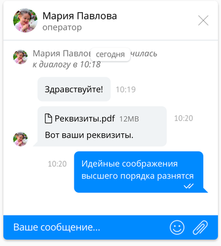

Цвет | Элементы
--- | ---
`colorMain` | Фон стартовой кнопки, фон сообщений клиента, фон поля ввода сообщения, границы и цвет текста кнопок 
`colorSecond` | Фон области предпросмотра вложений и цитируемых сообщений, границы и цвет текста кнопок при наведении  
`colorLines` | Цвет линий, фон сообщений оператора, границы текстовых полей
`colorSubText` | Цвет кнопки скрытия чата, цвет замещающего текста текстовых полей, цвет системных сообщений
`colorText` | Цвет текста, цвет текста в шапке
`colorBackground` | Фон виджета, цвет текста области предпросмотра вложений и цитируемых сообщений, цвет текста поля ввода сообщения, фон шапки


#### Тема "threadsim"

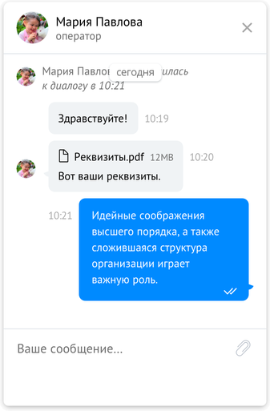

Цвет | Элементы
--- | ---
`colorMain` | Фон стартовой кнопки, фон сообщений клиента, фон кнопок, цвет текста области предпросмотра вложений и цитируемых сообщений 
`colorSecond` | Фон области предпросмотра вложений и цитируемых сообщений, фон кнопок при наведении  
`colorLines` | Цвет линий, фон сообщений оператора, границы текстовых полей
`colorSubText` | Цвет кнопки скрытия чата, цвет замещающего текста текстовых полей, цвет системных сообщений
`colorText` | Цвет текста, цвет текста поля ввода сообщения, цвет текста в шапке
`colorBackground` | Фон виджета, фон поля ввода сообщения, фон шапки


#### Тема "halcyon"

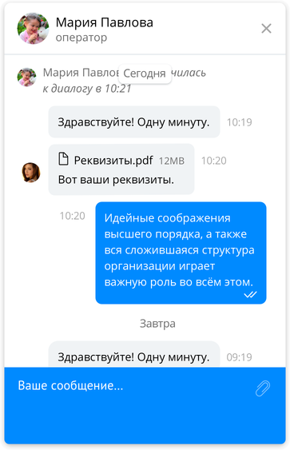

Цвет | Элементы
--- | ---
`colorMain` | Фон стартовой кнопки, фон сообщений клиента, фон поля ввода сообщения, границы и цвет текста кнопок 
`colorSecond` | Фон области предпросмотра вложений и цитируемых сообщений, границы и цвет текста кнопок при наведении  
`colorLines` | Цвет линий, фон сообщений оператора, границы текстовых полей
`colorSubText` | Цвет кнопки скрытия чата, цвет замещающего текста текстовых полей, цвет системных сообщений
`colorText` | Цвет текста, цвет текста в шапке
`colorBackground` | Фон виджета, цвет текста области предпросмотра вложений и цитируемых сообщений, цвет текста поля ввода сообщения, фон шапки


#### Тема "adaptive"

Особенностью данной темы является то, что окно Чата по высоте соответствует высоте области просмотра браузера. 

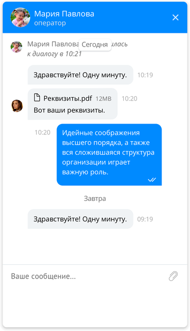

Цвет | Элементы
--- | ---
`colorMain` | Фон стартовой кнопки, фон сообщений клиента, фон кнопок, цвет текста области предпросмотра вложений и цитируемых сообщений, фон шапки
`colorSecond` | Фон области предпросмотра вложений и цитируемых сообщений, фон кнопок при наведении  
`colorLines` | Цвет линий, фон сообщений оператора, границы текстовых полей
`colorSubText` |  цвет замещающего текста текстовых полей, цвет системных сообщений
`colorText` | Цвет текста, цвет текста поля ввода сообщения
`colorBackground` | Цвет кнопки скрытия чата, фон виджета, фон поля ввода сообщения, цвет текста в шапке

### Настройка внешнего вида компонентов

Для тонкой настройки внешнего вида компонентов секция `theme` имеет шесть дочерних секций с настройками отображения компонентов Чата для различных типов устройств:
* `desktop` - настольные браузеры
* `mobile` - браузеры мобильных устройств
* `mobileS` - браузеры мобильных устройств с шириной экрана до 320px
* `mobileM` - браузеры мобильных устройств с шириной экрана от 321px до 375px
* `mobileL` - браузеры мобильных устройств с шириной экрана от 376px до 425px
* `tablet` - браузеры мобильных устройств с шириной экрана от 426px до 1023px

Каждая из этих секций может включать раздел `Global`, содержащий стили, которые будут наследоваться в стилях компонентов этой секции (и могут быть переопределены в стилях компонентов). Другими словами, если, например, в секции `desktop/Global` задать цвет текста (свойство `color`), то этот цвет будет использоваться всеми компонентами секции `desktop`, если в стилях компонента не задан другой цвет. Если установить значение свойства `color`, например у компонента `desktop/ChatInput`, то компонент будет использовать это переопределенное значение. Цепочка наследования и переопределения стилей в общем виде выглядит так:


Большинство настроек представляют из себя обычные CSS-свойства. Ниже приведены:
 * список компонентов для редактирования
 * соответствие свойств настроек компонентов с CSS-свойствами

#### Global

Базовые свойства. Применяются ко всем компонентам, если не перекрываются свойствами компонента

| Свойство в настройках | CSS-свойство | Описание |
|----------------------------------|--------------------------------|---------------------------------|
| fontFamily | [font-family](http://htmlbook.ru/css/font-family) | Семейство шрифта |
| fontSize | [font-size](http://htmlbook.ru/css/font-size) | Размер шрифта |
| color | [color](http://htmlbook.ru/css/color) | Цвет текста |

#### AttachmentButton

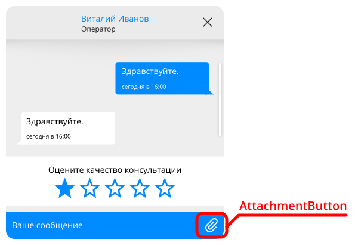

Кнопка прикрепления вложения

| Свойство в настройках | CSS-свойство | Описание |
|----------------------------------|--------------------------------|---------------------------------|
| opacity | [opacity](http://htmlbook.ru/css/opacity) | Непрозрачность |
| borderColor | [border-color](http://htmlbook.ru/css/border-color) | Цвет границы |
| borderLeftWidth | [border-left-width](http://htmlbook.ru/css/border-left-width) | Толщина границы слева |
| backgroundSize | [background-size](http://htmlbook.ru/css/background-size) | Размер изображения на кнопке |
| height | [height](http://htmlbook.ru/css/height) | Высота кнопки |
| width | [width](http://htmlbook.ru/css/width) | Ширина кнопки |
| top | [top](http://htmlbook.ru/css/top) | Отступ сверху относительно родительского компонента |
| right | [right](http://htmlbook.ru/css/right) | Отступ справа относительно родительского компонента |
| left | [left](http://htmlbook.ru/css/left) | Отступ слева относительно родительского компонента |
| backgroundImage | [background-image](http://htmlbook.ru/css/background-image) | Путь к изображению |
| backgroundImageHover | [background-image](http://htmlbook.ru/css/background-image) | Путь к изображению (при наведении) |

#### BackButton

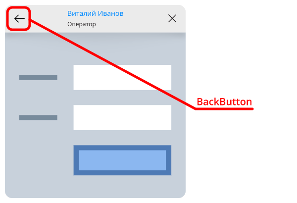

Кнопка "Назад" в шапке чата

| Свойство в настройках | CSS-свойство | Описание |
|----------------------------------|--------------------------------|---------------------------------|
| top | [top](http://htmlbook.ru/css/top) | Отступ кнопки от края чата сверху |
| left | [left](http://htmlbook.ru/css/left) | Отступ кнопки от края чата слева |
| right | [right](http://htmlbook.ru/css/right) | Отступ кнопки от края чата справа |
| width | [width](http://htmlbook.ru/css/width) | Ширина кнопки |
| height | [height](http://htmlbook.ru/css/height) | Высота кнопки |
| backgroundSize | [background-size](http://htmlbook.ru/css/background-size) | Размер изображения |
| backgroundImage | [background-image](http://htmlbook.ru/css/background-image) | Путь к изображению |
| backgroundImageHover | [background-image](http://htmlbook.ru/css/background-image) | Путь к изображению (при наведении) |

#### Button

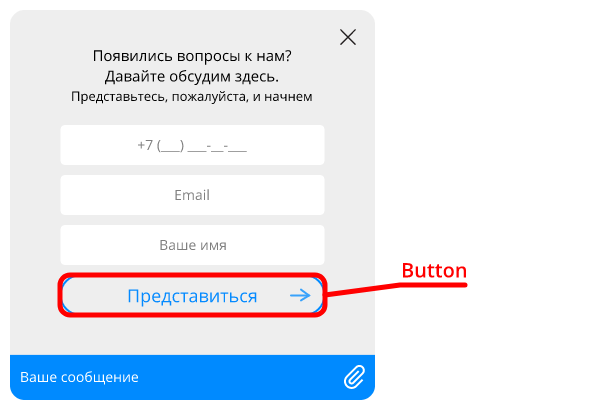

Кнопки в формах

| Свойство в настройках | CSS-свойство | Описание |
|----------------------------------|--------------------------------|---------------------------------|
| padding | [padding](http://htmlbook.ru/css/padding) | Внутренние отступы |
| maxHeight | [max-height](http://htmlbook.ru/css/max-height) | Максимальная высота |
| maxWidth | [max-width](http://htmlbook.ru/css/max-width) | Максимальная ширина |
| backgroundColor | [background-color](http://htmlbook.ru/css/background-color) | Цвет фона |
| backgroundImage | [background-image](http://htmlbook.ru/css/background-image) | Путь к изображению |
| backgroundPosition | [background-position](http://htmlbook.ru/css/background-position) | Позиционирование изображения |
| color | [color](http://htmlbook.ru/css/color) | Цвет текста |
| fontWeight | [font-weight](http://htmlbook.ru/css/font-weight) | Насыщенность шрифта |
| fontSize | [font-size](http://htmlbook.ru/css/font-size) | Размер шрифта |
| fontFamily | [font-family](http://htmlbook.ru/css/font-family) | Семейство шрифта |
| borderRadius | [border-radius](http://htmlbook.ru/css/border-radius) | Скругление углов |
| borderWidth | [border-width](http://htmlbook.ru/css/border-width) | Толщина границы |
| borderColor | [border-color](http://htmlbook.ru/css/border-color) | Цвет границы |
| borderStyle | [border-style](http://htmlbook.ru/css/border-style) | Стиль границы |
| margin | [margin](http://htmlbook.ru/css/margin) | Внешние отступы |
| backgroundImageHover | [background-image](http://htmlbook.ru/css/background-image) | Путь к изображению (при наведении) |
| borderColorHover | [border-color](http://htmlbook.ru/css/border-color) | Цвет границы (при наведении) |
| fontSizeHover | [font-size](http://htmlbook.ru/css/font-size) | Размер шрифта (при наведении) |
| colorHover | [color](http://htmlbook.ru/css/color) | Цвет текста (при наведении) |
| backgroundColorHover | [background-color](http://htmlbook.ru/css/background-color) | Цвет фона (при наведении) |

#### Chat

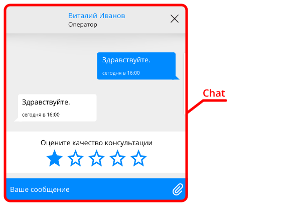

Общие настройки чата

| Свойство в настройках | CSS-свойство | Описание |
|----------------------------------|--------------------------------|---------------------------------|
| borderRadius | [border-radius](http://htmlbook.ru/css/border-radius) | Скругление углов |
| boxShadow | [box-shadow](http://htmlbook.ru/css/box-shadow) | Тень |
| height | [height](http://htmlbook.ru/css/height) | Высота |
| width | [width](http://htmlbook.ru/css/width) | Ширина |
| right | [right](http://htmlbook.ru/css/right) | Отступ от правого края экрана |
| bottom | [bottom](http://htmlbook.ru/css/bottom) | Отступ от нижнего края экрана |
| scrollbarWidth | [width](http://htmlbook.ru/css/width) | Ширина полосы прокрутки |
| scrollbarBackgroundColor | [background-color](http://htmlbook.ru/css/background-color) | Цвет полосы прокрутки |
| scrollbarBorderRadius | [border-radius](http://htmlbook.ru/css/border-radius) | Скругление углов полосы прокрутки |

#### ChatBody

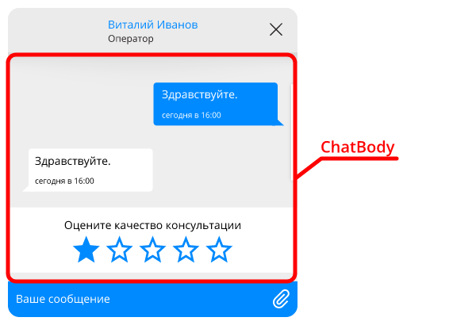

Область переписки

| Свойство в настройках | CSS-свойство | Описание |
|----------------------------------|--------------------------------|---------------------------------|
| backgroundColor | [background-color](http://htmlbook.ru/css/background-color) | Цвет фона |
| boxShadow | [box-shadow](http://htmlbook.ru/css/box-shadow) | Тень |

#### ChatButton

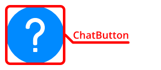

Стартовая кнопка

| Свойство в настройках | CSS-свойство | Описание |
|----------------------------------|--------------------------------|---------------------------------|
| backgroundSize | [background-size](http://htmlbook.ru/css/background-size) | Размер изображения на кнопке |
| backgroundImage | [background-image](http://htmlbook.ru/css/background-image) | Путь к изображению на кнопке |
| backgroundColor | [background-color](http://htmlbook.ru/css/background-color) | Фон кнопки |
| borderRadius | [border-radius](http://htmlbook.ru/css/border-radius) | Скругление углов кнопки |
| boxShadow | [box-shadow](http://htmlbook.ru/css/box-shadow) | Тень кнопки |
| height | [height](http://htmlbook.ru/css/height) | Высота кнопки |
| width | [width](http://htmlbook.ru/css/width) | Ширина кнопки |
| right | [right](http://htmlbook.ru/css/right) | Отступ от правого края экрана |
| bottom | [bottom](http://htmlbook.ru/css/bottom) | Отступ от нижнего края экрана |

#### ChatHeader

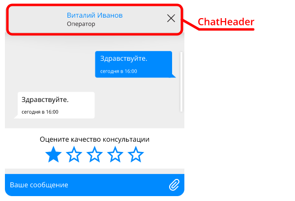

Шапка чата

| Свойство в настройках | CSS-свойство | Описание |
|----------------------------------|--------------------------------|---------------------------------|
| welcomeFontSize | [font-size](http://htmlbook.ru/css/font-size) | Размер шрифта "Добро пожаловать в чат!" |
| welcomeFontWeight | [font-weight](http://htmlbook.ru/css/font-weight) | Насыщенность шрифта "Добро пожаловать в чат!" |
| welcomeFontColor | [color](http://htmlbook.ru/css/color) | Цвет шрифта "Добро пожаловать в чат!" |
| searchingFontSize | [font-size](http://htmlbook.ru/css/font-size) | Размер шрифта "Поиск оператора" |
| searchingFontWeight | [font-weight](http://htmlbook.ru/css/font-weight) | Насыщенность шрифта "Поиск оператора" |
| searchingColor | [color](http://htmlbook.ru/css/color) | Цвет шрифта "Поиск оператора" |
| spinnerBackgroundImage | [background-image](http://htmlbook.ru/css/background-image) | Изображение для прелоадера |
| borderBottom | [border-bottom](http://htmlbook.ru/css/border-bottom) | Нижняя граница компонента |
| padding | [padding](http://htmlbook.ru/css/padding) | Внутренние отступы |
| align | [text-align](http://htmlbook.ru/css/text-align) | Выравнивание содержимого блока |
| height | [height](http://htmlbook.ru/css/height) | Высота |
| backgroundColor | [background-color](http://htmlbook.ru/css/background-color) | Цвет фона |
| fontFamily | [font-family](http://htmlbook.ru/css/font-family) | Семейство шрифта |
| fontSize | [font-size](http://htmlbook.ru/css/font-size) | Размер шрифта |
| color | [color](http://htmlbook.ru/css/color) | Цвет текста |
| avatarWidth | [width](http://htmlbook.ru/css/width) | Ширина аватара |
| avatarHeight | [height](http://htmlbook.ru/css/height) | Высота аватара |
| agentNameColor | [color](http://htmlbook.ru/css/color) | Цвет имени агента |
| agentNameFontSize | [font-size](http://htmlbook.ru/css/font-size) | Размер шрифта имени агента |
| agentNameFontWeight | [font-weight](http://htmlbook.ru/css/font-weight) | Насыщенность шрифта имени агента |
| agentNameMaxWidth | [max-width](http://htmlbook.ru/css/max-width) | Максимальная ширина имени агента |
| agentInfoColor | [color](http://htmlbook.ru/css/color) | Цвет дополнительной информации |
| agentInfoFontSize | [font-size](http://htmlbook.ru/css/font-size) | Размер шрифта дополнительной информации |
| agentInfoFontWeight | [font-weight](http://htmlbook.ru/css/font-weight) | Насыщенность шрифта дополнительной информации |
| agentInfoMaxWidth | [max-width](http://htmlbook.ru/css/max-width) | Максимальная ширина дополнительной информации |

#### ChatInput

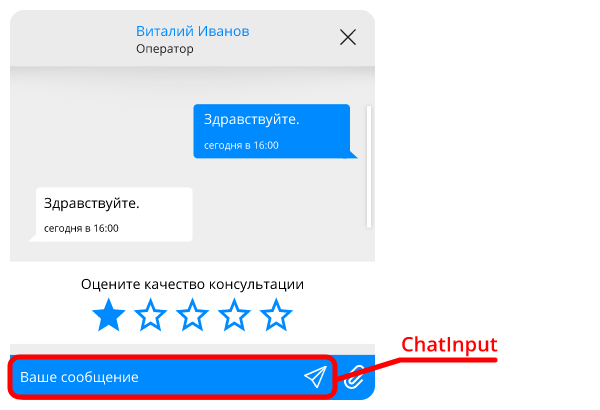

Поле ввода сообщения

| Свойство в настройках | CSS-свойство | Описание |
|----------------------------------|--------------------------------|---------------------------------|
| submitButtonOpacity | [opacity](http://htmlbook.ru/css/opacity) | Непрозрачность кнопки отправки сообщения |
| submitButtonDisplay | [display](http://htmlbook.ru/css/display) | Способ отображения кнопки отправки сообщения |
| submitButtonRight | [right](http://htmlbook.ru/css/right) | Отступ справа кнопки отправки сообщения относительно родительского компонента |
| submitButtonTop | [top](http://htmlbook.ru/css/top) | Отступ сверху кнопки отправки сообщения относительно родительского компонента |
| submitButtonBackgroundImage | [background-image](http://htmlbook.ru/css/background-image) | Путь к изображению кнопки отправки сообщения |
| limiterMargin | [margin](http://htmlbook.ru/css/margin) | Внешние отступы ограничителя компонента |
| limiterWidth | [width](http://htmlbook.ru/css/width) | Ширина ограничителя компонента |
| limiterMaxHeight | [max-height](http://htmlbook.ru/css/max-height) | Максимально допустимая высота ограничителя компонента |
| wrapperHeight | [height](http://htmlbook.ru/css/height) | Высота компонента |
| wrapperBorderTop | [border-top](http://htmlbook.ru/css/border-top) | Верхняя граница компонента |
| wrapperBorder | [border](http://htmlbook.ru/css/border) | Граница компонента |
| wrapperPadding | [padding](http://htmlbook.ru/css/padding) | Внутренние отступы компонента |
| wrapperBackgroundColor | [background-color](http://htmlbook.ru/css/background-color) | Цвет фона компонента |
| placeholderColor | [color](http://htmlbook.ru/css/color) | Цвет замещающего текста |
| backgroundColor | [background-color](http://htmlbook.ru/css/background-color) | Цвет фона поля ввода |
| color | [color](http://htmlbook.ru/css/color) | Цвет текста в поле ввода |
| fontSize | [font-size](http://htmlbook.ru/css/font-size) | Размер шрифта |
| fontWeight | [font-weight](http://htmlbook.ru/css/font-weight) | Насыщенность шрифта |
| borderTopWidth | [border-top-width](http://htmlbook.ru/css/border-top-width) | Толщина границы сверху |
| borderRightWidth | [border-right-width](http://htmlbook.ru/css/border-right-width) | Толщина границы справа |
| borderBottomWidth | [border-bottom-width](http://htmlbook.ru/css/border-bottom-width) | Толщина границы снизу |
| borderLeftWidth | [border-left-width](http://htmlbook.ru/css/border-left-width) | Толщина границы слева |
| borderColor | [border-color](http://htmlbook.ru/css/border-color) | Цвет границы |
| padding | [padding](http://htmlbook.ru/css/padding) | Внутренние отступы текстового поля |

#### ChatInvite

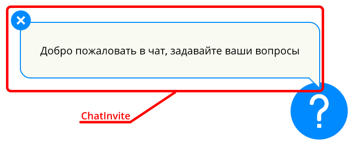

Пузырь с приглашающим сообщением

| Свойство в настройках | CSS-свойство | Описание |
|----------------------------------|--------------------------------|---------------------------------|
| color | [color](http://htmlbook.ru/css/color) | Цвет текста |
| fontFamily | [font-family](http://htmlbook.ru/css/font-family) | Семейство шрифта |
| fontSize | [font-size](http://htmlbook.ru/css/font-size) | Размер шрифта |
| padding | [padding](http://htmlbook.ru/css/padding) | Внутренние отступы |
| maxWidth | [max-width](http://htmlbook.ru/css/max-width) | Максимальная ширина |
| backgroundColor | [background-color](http://htmlbook.ru/css/background-color) | Цвет фона пузыря |
| filter | [filter](http://htmlbook.ru/css/filter) | Фильтр |
| height | [height](http://htmlbook.ru/css/height) | Высота |
| width | [width](http://htmlbook.ru/css/width) | Ширина |
| right | [right](http://htmlbook.ru/css/right) | Отступ от правого края экрана |
| bottom | [bottom](http://htmlbook.ru/css/bottom) | Отступ от нижнего края экрана |
| buttonColor | [color](http://htmlbook.ru/css/color) | Цвет крестика кнопки "Закрыть" |
| buttonBackgroundColor | [background-color](http://htmlbook.ru/css/background-color) | Цвет фона кнопки "Закрыть" |

#### ChatMessagesBadge

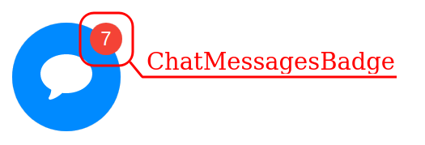

Бейдж с количеством непрочитанных сообщений у кнопки чата

| Свойство в настройках | CSS-свойство | Описание |
|----------------------------------|--------------------------------|---------------------------------|
| color | [color](http://htmlbook.ru/css/color) | Цвет текста |
| fontFamily | [font-family](http://htmlbook.ru/css/font-family) | Семейство шрифта |
| fontSize | [font-size](http://htmlbook.ru/css/font-size) | Размер шрифта |
| lineHeight | [line-height](http://htmlbook.ru/css/line-height) | Высота строки |
| backgroundColor | [background-color](http://htmlbook.ru/css/background-color) | Цвет фона пузыря |
| height | [height](http://htmlbook.ru/css/height) | Высота |
| width | [width](http://htmlbook.ru/css/width) | Ширина для счетчика не превышающего 1 разряд (от 1 до 9) |
| right | [right](http://htmlbook.ru/css/right) | Отступ от правого края экрана |
| bottom | [bottom](http://htmlbook.ru/css/bottom) | Отступ от нижнего края экрана |
| borderRadius | [border-radius](http://htmlbook.ru/css/border-radius) | Радиус скругления |

#### ChatPoll

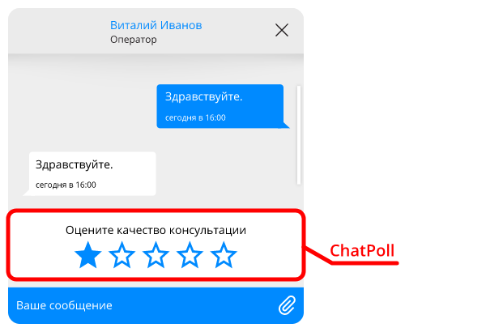

Опрос

| Свойство в настройках | CSS-свойство | Описание |
|----------------------------------|--------------------------------|---------------------------------|
| starDisabledOutlineImage | [background-image](http://htmlbook.ru/css/background-image) | Путь к изображению "пустой недоступной" звездочки |
| starOutlineImage | [background-image](http://htmlbook.ru/css/background-image) | Путь к изображению "пустой" звездочки |
| starFilledImage | [background-image](http://htmlbook.ru/css/background-image) | Путь к изображению "заполненной" звездочки |
| starFilledRatedImage | [background-image](http://htmlbook.ru/css/background-image) | Путь к изображению "заполненной" звездочки для вывода результата |
| starWidth | [width](http://htmlbook.ru/css/width) | Ширина звездочки |
| starHeight | [height](http://htmlbook.ru/css/height) | Высота звездочки |
| textMargin | [margin](http://htmlbook.ru/css/margin) | Внешние отступы текста вопроса |
| color | [color](http://htmlbook.ru/css/color) | Цвет текста вопроса |
| fontSize | [font-size](http://htmlbook.ru/css/font-size) | Размер шрифта текста вопроса |
| fontFamily | [font-family](http://htmlbook.ru/css/font-family) | Семейство шрифта текста вопроса |
| fontWeight | [font-weight](http://htmlbook.ru/css/font-weight) | Насыщеность шрифта текста вопроса |
| thanksFontWeight | [font-weight](http://htmlbook.ru/css/font-weight) | Насыщеность шрифта текста благодарности |
| thanksColor | [color](http://htmlbook.ru/css/color) | Цвет текста благодарности |
| thanksFontSize | [font-size](http://htmlbook.ru/css/font-size) | Размер шрифта текста благодарности |
| thanksFontFamily | [font-family](http://htmlbook.ru/css/font-family) | Семейство шрифта текста благодарности |
| margin | [margin](http://htmlbook.ru/css/margin) | Внешние отступы |
| backgroundColor | [background-color](http://htmlbook.ru/css/background-color) | Цвет фона |

#### ChatWelcome

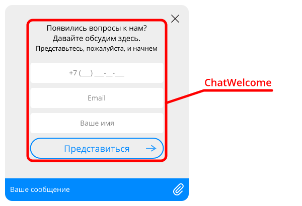

Экран приветствия

| Свойство в настройках | CSS-свойство | Описание |
|----------------------------------|--------------------------------|---------------------------------|
| width | [width](http://htmlbook.ru/css/width) | Ширина |
| maxWidth | [max-width](http://htmlbook.ru/css/max-width) | Максимальная ширина |
| textAlign | [text-align](http://htmlbook.ru/css/text-align) | Выравнивание текста |
| margin | [margin](http://htmlbook.ru/css/margin) | Внешние отступы блока формы |
| headerMargin | [margin](http://htmlbook.ru/css/margin) | Внешние отступы заголовка формы |
| buttonMargin | [margin](http://htmlbook.ru/css/margin) | Внешние отступы кнопки |
| buttonFontSize | [font-size](http://htmlbook.ru/css/font-size) | Размер шрифта текста кнопки |
| textColor | [color](http://htmlbook.ru/css/color) | Цвет основного текста |
| textFontSize | [font-size](http://htmlbook.ru/css/font-size) | Размер шрифта основного текста |
| textFontFamily | [font-family](http://htmlbook.ru/css/font-family) | Семейство шрифта основного текста |
| textTextAlign | [text-align](http://htmlbook.ru/css/text-align) | Выравнивание текста у основного текста |
| textMarginBottom | [margin-bottom](http://htmlbook.ru/css/margin-bottom) | Отступ снизу у основного текста |
| subtextColor | [color](http://htmlbook.ru/css/color) | Цвет дополнительного текста |
| subtextFontSize | [font-size](http://htmlbook.ru/css/font-size) | Размер шрифта дополнительного текста |
| subtextFontFamily | [font-family](http://htmlbook.ru/css/font-family) | Семейство шрифта дополнительного текста |
| subtextTextAlign | [text-align](http://htmlbook.ru/css/text-align) | Выравнивание текста у дополнительного текста |
| subtextMarginBottom | [margin-bottom](http://htmlbook.ru/css/margin-bottom) | Отступ снизу у дополнительного текста |
| greetTextColor | [color](http://htmlbook.ru/css/color) | Цвет основного текста приветственного сообщения |
| greetTextFontSize | [font-size](http://htmlbook.ru/css/font-size) | Размер шрифта основного текста приветственного сообщения |
| greetTextFontFamily | [font-family](http://htmlbook.ru/css/font-family) | Семейство шрифта основного текста приветственного сообщения |
| greetTextTextAlign | [text-align](http://htmlbook.ru/css/text-align) | Выравнивание текста у основного текста приветственного сообщения |
| greetTextMarginBottom | [margin-bottom](http://htmlbook.ru/css/margin-bottom) | Отступ снизу у основного текста приветственного сообщения |
| greetSubtextColor | [color](http://htmlbook.ru/css/color) | Цвет дополнительного текста приветственного сообщения |
| greetSubtextFontSize | [font-size](http://htmlbook.ru/css/font-size) | Размер шрифта дополнительного текста приветственного сообщения |
| greetSubtextFontFamily | [font-family](http://htmlbook.ru/css/font-family) | Семейство шрифта дополнительного текста приветственного сообщения |
| greetSubtextTextAlign | [text-align](http://htmlbook.ru/css/text-align) | Выравнивание текста у дополнительного текста приветственного сообщения |
| greetSubtextMarginBottom | [margin-bottom](http://htmlbook.ru/css/margin-bottom) | Отступ снизу у дополнительного текста приветственного сообщения |
| greetImageDisplay | [display](http://htmlbook.ru/css/display) | Способ отобращения изображения приветственного сообщения |
| greetImageMargin | [margin](http://htmlbook.ru/css/margin) | Внешние отступы изображения приветственного сообщения |
| greetImageBackgroundImage | [background-image](http://htmlbook.ru/css/background-image) | Путь к изображению проветственного сообщения |
| greetImageWidth | [width](http://htmlbook.ru/css/width) | Ширина изображения приветственного сообщения |
| greetImageHeight | [height](http://htmlbook.ru/css/height) | Высота изображения приветственного сообщения |
| feedbackPadding | [padding](http://htmlbook.ru/css/padding) | Внутренние отступы текста сообщения |
| feedbackTextAlign | [text-align](http://htmlbook.ru/css/text-align) | Выравнивание текста сообщения |
| feedbackFontWeight | [font-weight](http://htmlbook.ru/css/font-weight) | Насыщенность шрифта текста сообщения |
| feedbackColor | [color](http://htmlbook.ru/css/color) | Цвет текста сообщения |
| feedbackFontSize | [font-size](http://htmlbook.ru/css/font-size) | Размер шрифта текста сообщения |
| feedbackFontFamily | [font-family](http://htmlbook.ru/css/font-family) | Семейство шрифта текста сообщения |
| feedbackPlaceholderColor | [color](http://htmlbook.ru/css/color) | Цвет замещающего текста сообщения |
| feedbackMargin | [margin](http://htmlbook.ru/css/margin) | Внешние отступы текста сообщения |
| feedbackBackgroundColor | [background-color](http://htmlbook.ru/css/background-color) | Цвет фона текста сообщения |
| feedbackBorderRadius | [border-radius](http://htmlbook.ru/css/border-radius) | Скругление углов текста сообщения |
| feedbackBorderTopWidth | [border-top-width](http://htmlbook.ru/css/border-top-width) | Толщина границы сверху текста сообщения |
| feedbackBorderRightWidth | [border-right-width](http://htmlbook.ru/css/border-right-width) | Толщина границы справа текста сообщения |
| feedbackBorderBottomWidth | [border-bottom-width](http://htmlbook.ru/css/border-bottom-width) | Толщина границы снизу текста сообщения |
| feedbackBorderLeftWidth | [border-left-width](http://htmlbook.ru/css/border-left-width) | Толщина границы слева текста сообщения |
| feedbackBorderColor | [border-color](http://htmlbook.ru/css/border-color) | Цвет границы текста сообщения |
| feedbackLimiterColor | [color](http://htmlbook.ru/css/color) | Внешние отступы текста сообщения |
| feedbackLimiterMargin | [margin](http://htmlbook.ru/css/margin) | Внешние отступы текста сообщения |

#### CloseButton

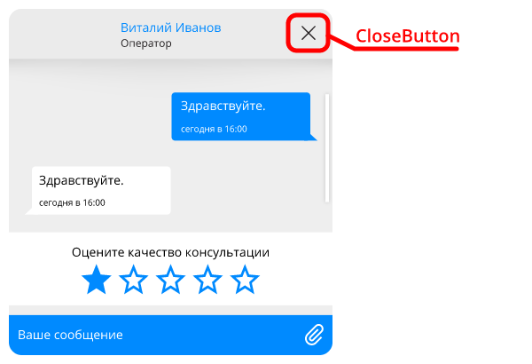

Кнопка скрытия чата

| Свойство в настройках | CSS-свойство | Описание |
|----------------------------------|--------------------------------|---------------------------------|
| top | [top](http://htmlbook.ru/css/top) | Отступ кнопки от края чата сверху |
| left | [left](http://htmlbook.ru/css/left) | Отступ кнопки от края чата слева |
| right | [right](http://htmlbook.ru/css/right) | Отступ кнопки от края чата справа |
| width | [width](http://htmlbook.ru/css/width) | Ширина кнопки |
| height | [height](http://htmlbook.ru/css/height) | Высота кнопки |
| backgroundSize | [background-size](http://htmlbook.ru/css/background-size) | Размер изображения |
| backgroundImage | [background-image](http://htmlbook.ru/css/background-image) | Путь к изображению |
| backgroundImageHover | [background-image](http://htmlbook.ru/css/background-image) | Путь к изображению (при наведении) |

#### DateBar

Дата сообщений

| Свойство в настройках | CSS-свойство | Описание |
|----------------------------------|--------------------------------|---------------------------------|
| color | [color](http://htmlbook.ru/css/color) | Цвет текста |
| fontWeight | [font-weight](http://htmlbook.ru/css/font-weight) | Насыщенность шрифта |
| fontFamily | [font-family](http://htmlbook.ru/css/font-family) | Гарнитура |
| fontSize | [font-size](http://htmlbook.ru/css/font-size) | Размер шрифта |
| padding | [padding](http://htmlbook.ru/css/padding) | Внутренние отступы |
| borderRadius | [border-radius](http://htmlbook.ru/css/border-radius) | Скругление углов |
| boxShadow | [box-shadow](http://htmlbook.ru/css/box-shadow) | Тень |
| backgroundColor | [background-color](http://htmlbook.ru/css/background-color) | Цвет фона |

#### Emoji

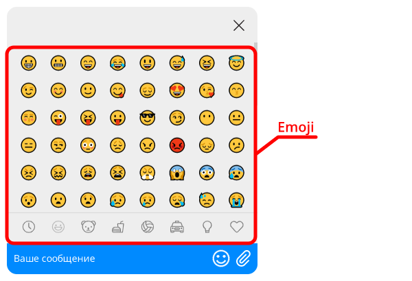

Настройки эмодзи

| Свойство в настройках | CSS-свойство | Описание |
|----------------------------------|--------------------------------|---------------------------------|
| backgroundColor | [background-color](http://htmlbook.ru/css/background-color) | Цвет фона |

#### EmojiButton

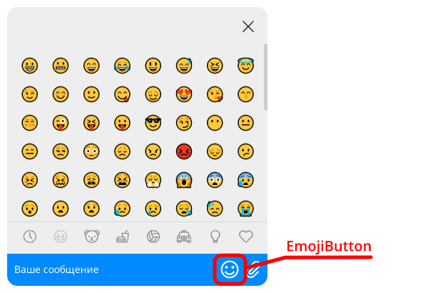

Настройки кнопки эмодзи

| Свойство в настройках | CSS-свойство | Описание |
|----------------------------------|--------------------------------|---------------------------------|
| opacity | [opacity](http://htmlbook.ru/css/opacity) | Непрозрачность |
| borderColor | [border-color](http://htmlbook.ru/css/border-color) | Цвет границы |
| borderLeftWidth | [border-left-width](http://htmlbook.ru/css/border-left-width) | Толщина границы слева |
| backgroundSize | [background-size](http://htmlbook.ru/css/background-size) | Размер изображения на кнопке |
| height | [height](http://htmlbook.ru/css/height) | Высота кнопки |
| width | [width](http://htmlbook.ru/css/width) | Ширина кнопки |
| top | [top](http://htmlbook.ru/css/top) | Отступ сверху относительно родительского компонента |
| right | [right](http://htmlbook.ru/css/right) | Отступ справа относительно родительского компонента |
| left | [left](http://htmlbook.ru/css/left) | Отступ слева относительно родительского компонента |
| backgroundImage | [background-image](http://htmlbook.ru/css/background-image) | Путь к изображению |
| backgroundImageHover | [background-image](http://htmlbook.ru/css/background-image) | Путь к изображению (при наведении) |

#### InputText

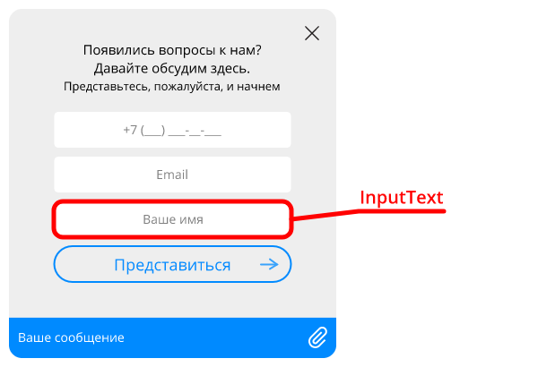

Текстовые поля в формах

| Свойство в настройках | CSS-свойство | Описание |
|----------------------------------|--------------------------------|---------------------------------|
| placeholderColor | [color](http://htmlbook.ru/css/color) | Цвет замещающего текста |
| margin | [margin](http://htmlbook.ru/css/margin) | Внешние отступы |
| padding | [padding](http://htmlbook.ru/css/padding) | Внутренние отступы |
| textAlign | [text-align](http://htmlbook.ru/css/text-align) | Выравнивание текста |
| fontWeight | [font-weight](http://htmlbook.ru/css/font-weight) | Насыщенность шрифта |
| backgroundColor | [background-color](http://htmlbook.ru/css/background-color) | Цвет фона |
| color | [color](http://htmlbook.ru/css/color) | Цвет текста |
| fontSize | [font-size](http://htmlbook.ru/css/font-size) | Размер шрифта |
| fontFamily | [font-family](http://htmlbook.ru/css/font-family) | Семейство шрифта |
| borderRadius | [border-radius](http://htmlbook.ru/css/border-radius) | Скругление углов |
| borderTopWidth | [border-top-width](http://htmlbook.ru/css/border-top-width) | Толщина границы сверху |
| borderRightWidth | [border-right-width](http://htmlbook.ru/css/border-right-width) | Толщина границы справа |
| borderBottomWidth | [border-bottom-width](http://htmlbook.ru/css/border-bottom-width) | Толщина границы снизу |
| borderLeftWidth | [border-left-width](http://htmlbook.ru/css/border-left-width) | Толщина границы слева |
| borderColor | [border-color](http://htmlbook.ru/css/border-color) | Цвет границы |
| errorBackground | [background-color](http://htmlbook.ru/css/background-color) | Цвет фона при ошибке |

#### Link

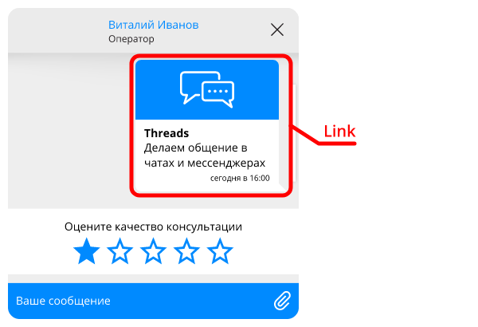

Превью ссылки

| Свойство в настройках | CSS-свойство | Описание |
|----------------------------------|--------------------------------|---------------------------------|
| containerType | - | Тип представления превью ссылки. Варианты: "full" (по умолчанию), "compact". |
| containerBorder | [border](http://htmlbook.ru/css/border) | Граница превью ссылки |
| outMarginRight | [margin-right](http://htmlbook.ru/css/margin-right) | Отступ справа для превью у исходящего сообщения |
| inMarginLeft | [margin-left](http://htmlbook.ru/css/margin-left) | Отступ слева для превью у входящего сообщения |
| titleFontWeight | [font-weight](http://htmlbook.ru/css/font-weight) | Насыщенность шрифта заголовка страницы |
| titleFontSize | [font-size](http://htmlbook.ru/css/font-size) | Размер шрифта заголовка страницы |
| titleColor | [color](http://htmlbook.ru/css/color) | Цвет шрифта заголовка страницы |
| urlFontSize | [font-size](http://htmlbook.ru/css/font-size) | Размер шрифта ссылки |
| urlColor | [color](http://htmlbook.ru/css/color) | Цвет шрифта ссылки |
| descriptionFontSize | [font-size](http://htmlbook.ru/css/font-size) | Размер шрифта описания |
| descriptionColor | [color](http://htmlbook.ru/css/color) | Цвет шрифта описания |

#### MessageClient

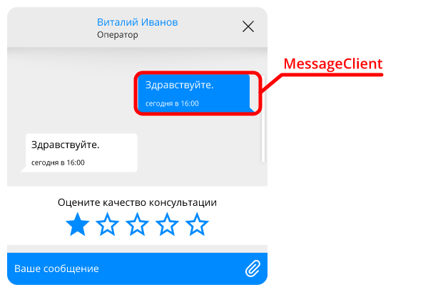

Исходящие сообщения

| Свойство в настройках | CSS-свойство | Описание |
|----------------------------------|--------------------------------|---------------------------------|
| margin | [margin](http://htmlbook.ru/css/margin) | Внешние отступы сообщения |
| color | [color](http://htmlbook.ru/css/color) | Цвет текста |
| fontFamily | [font-family](http://htmlbook.ru/css/font-family) | Семейство шрифта |
| fontSize | [font-size](http://htmlbook.ru/css/font-size) | Размер шрифта |
| backgroundColor | [background-color](http://htmlbook.ru/css/background-color) | Цвет фона |
| borderTopLeftRadius | [border-top-left-radius](http://htmlbook.ru/css/border-top-left-radius) | Скругление верхнего левого угла |
| borderBottomLeftRadius | [border-bottom-left-radius](http://htmlbook.ru/css/border-bottom-left-radius) | Скругление нижнего левого угла |
| borderTopRightRadius | [border-top-right-radius](http://htmlbook.ru/css/border-top-right-radius) | Скругление верхнего правого угла |
| borderBottomRightRadius | [border-bottom-right-radius](http://htmlbook.ru/css/border-bottom-right-radius) | Скругление нижнего правого угла |
| pointerDisplay | [display](http://htmlbook.ru/css/display) | Способ отображения указателя |
| marginTop | [margin-top](http://htmlbook.ru/css/margin-top) | Верхнее поле отступа |
| quoteColor | [color](http://htmlbook.ru/css/color) | Цвет текста цитируемого сообщения |
| quoteFontSize | [font-size](http://htmlbook.ru/css/font-size) | Размер шрифта текста цитируемого сообщения |
| quoteBorderColor | [border-color](http://htmlbook.ru/css/border-color) | Цвет границы цитируемого сообщения |
| addQuoteImage | [background-image](http://htmlbook.ru/css/background-image) | Путь к изображению кнопки цитирования |
| attachmentImageWidth | [width](http://htmlbook.ru/css/width) | Ширина прикрепленного изображения |
| attachmentImageHeight | [height](http://htmlbook.ru/css/height) | Высота прикрепленного изображения |
| attachmentImagePadding | [padding](http://htmlbook.ru/css/padding) | Внешние отступы сообщения c прикрепленным изображением |
| attachmentImageInfoColor | [color](http://htmlbook.ru/css/color) | Цвет описания прикрепленного изображения |
| attachmentImageInfoFontSize | [font-size](http://htmlbook.ru/css/font-size) | Размер шрифта описания прикрепленного изображения |
| statusIconWidth | [width](http://htmlbook.ru/css/width) | Ширина иконки статуса прочитанности сообщения |
| statusIconHeight | [height](http://htmlbook.ru/css/height) | Высота иконки статуса прочитанности сообщения |
| statusIconColor | - | Цвет иконки статуса прочитанности сообщения |
| linkFontFamily | [font-family](http://htmlbook.ru/css/font-family) | Гарнитура ссылки |
| linkFontSize | [font-size](http://htmlbook.ru/css/font-size) | Размер шрифта ссылки |
| linkColor | [color](http://htmlbook.ru/css/color) | Цвет текста ссылки |
| linkFontWeight | [font-weight](http://htmlbook.ru/css/font-weight) | Насыщенность шрифта ссылки |
| attachmentIcon | [background-image](http://htmlbook.ru/css/background-image) | Пиктограмма вложения |
| attachmentIconSize | [background-size](http://htmlbook.ru/css/background-size) | Размер пиктограммы вложения |
| attachmentIconHover | [background-image](http://htmlbook.ru/css/background-image) | Пиктограмма вложения (при наведении) |

#### MessageOperator

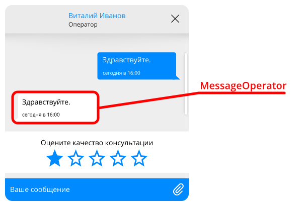

Входящие сообщения

| Свойство в настройках | CSS-свойство | Описание |
|----------------------------------|--------------------------------|---------------------------------|
| notificationColor | [color](http://htmlbook.ru/css/color) | Цвет текста нотификации |
| notificationFontFamily | [font-family](http://htmlbook.ru/css/font-family) | Семейство шрифта нотификации |
| notificationFontSize | [font-size](http://htmlbook.ru/css/font-size) | Размер шрифта нотификации |
| notificationJoinDisplay | [display](http://htmlbook.ru/css/display) | Способ отображения нотификации "Оператор присоединился" |
| notificationJoinBorderTop | [border-top](http://htmlbook.ru/css/border-top) | Верхняя граница нотификации "Оператор присоединился" |
| notificationJoinBorderBottom | [border-bottom](http://htmlbook.ru/css/border-bottom) | Нижняя граница нотификации "Оператор присоединился" |
| notificationJoinPadding | [padding](http://htmlbook.ru/css/padding) | Внутренний отступ нотификации "Оператор присоединился" |
| notificationJoinMargin | [margin](http://htmlbook.ru/css/margin) | Внешний отступ нотификации "Оператор присоединился" |
| notificationJoinAvatarDisplay | [display](http://htmlbook.ru/css/display) | Способ отображения аватара в нотификации "Оператор присоединился" |
| notificationJoinAvatarWidth | [width](http://htmlbook.ru/css/width) | Ширина аватара в нотификации "Оператор присоединился" |
| notificationJoinAvatarHeight | [height](http://htmlbook.ru/css/height) | Высота аватара в нотификации "Оператор присоединился" |
| notificationJoinNameDisplay | [display](http://htmlbook.ru/css/display) | Способ отображения имени в нотификации "Оператор присоединился" |
| notificationJoinNameFontSize | [font-size](http://htmlbook.ru/css/font-size) | Размер шрифта имени в нотификации "Оператор присоединился" |
| notificationJoinNameFontWeight | [font-weight](http://htmlbook.ru/css/font-weight) | Насыщенность шрифта имени в нотификации "Оператор присоединился" |
| notificationJoinTextDisplay | [display](http://htmlbook.ru/css/display) | Способ отображения сообщения в нотификации "Оператор присоединился" |
| notificationJoinTextColor | [color](http://htmlbook.ru/css/color) | Цвет текста в нотификации "Оператор присоединился" |
| notificationJoinTextFontSize | [font-size](http://htmlbook.ru/css/font-size) | Размер шрифта сообщения в нотификации "Оператор присоединился" |
| notificationJoinDateDisplay | [display](http://htmlbook.ru/css/display) | Способ отображения даты в нотификации "Оператор присоединился" |
| notificationJoinDateFontSize | [font-size](http://htmlbook.ru/css/font-size) | Размер шрифта даты в нотификации "Оператор присоединился" |
| notificationJoinDateColor | [color](http://htmlbook.ru/css/color) | Цвет даты в нотификации "Оператор присоединился" |
| notificationLeftDisplay | [display](http://htmlbook.ru/css/display) | Способ отображения нотификации "Оператор отключился" |
| notificationLeftBorderTop | [border-top](http://htmlbook.ru/css/border-top) | Верхняя граница нотификации "Оператор отключился" |
| notificationLeftBorderBottom | [border-bottom](http://htmlbook.ru/css/border-bottom) | Нижняя граница нотификации "Оператор отключился" |
| notificationLeftPadding | [padding](http://htmlbook.ru/css/padding) | Внутренний отступ нотификации "Оператор отключился" |
| notificationLeftMargin | [margin](http://htmlbook.ru/css/margin) | Внешний отступ нотификации "Оператор отключился" |
| notificationLeftAvatarDisplay | [display](http://htmlbook.ru/css/display) | Способ отображения аватара в нотификации "Оператор отключился" |
| notificationLeftAvatarWidth | [width](http://htmlbook.ru/css/width) | Ширина аватара в нотификации "Оператор отключился" |
| notificationLeftAvatarHeight | [height](http://htmlbook.ru/css/height) | Высота аватара в нотификации "Оператор отключился" |
| notificationLeftNameDisplay | [display](http://htmlbook.ru/css/display) | Способ отображения имени в нотификации "Оператор отключился" |
| notificationLeftNameFontSize | [font-size](http://htmlbook.ru/css/font-size) | Размер шрифта имени в нотификации "Оператор отключился" |
| notificationLeftNameFontWeight | [font-weight](http://htmlbook.ru/css/font-weight) | Насыщенность шрифта имени в нотификации "Оператор отключился" |
| notificationLeftTextDisplay | [display](http://htmlbook.ru/css/display) | Способ отображения сообщения в нотификации "Оператор отключился" |
| notificationLeftTextColor | [color](http://htmlbook.ru/css/color) | Цвет текста сообщения в нотификации "Оператор отключился" |
| notificationLeftTextFontSize | [font-size](http://htmlbook.ru/css/font-size) | Размер шрифта сообщения в нотификации "Оператор отключился" |
| notificationLeftDateDisplay | [display](http://htmlbook.ru/css/display) | Способ отображения даты в нотификации "Оператор отключился" |
| notificationLeftDateFontSize | [font-size](http://htmlbook.ru/css/font-size) | Размер шрифта даты в нотификации "Оператор отключился" |
| notificationLeftDateColor | [color](http://htmlbook.ru/css/color) | Цвет даты в нотификации "Оператор отключился" |
| margin | [margin](http://htmlbook.ru/css/margin) | Внешние отступы сообщения |
| avatarDisplay | [display](http://htmlbook.ru/css/display) | Способ отображения аватара |
| avatarImage | [background-image](http://htmlbook.ru/css/background-image) | Путь к изображению аватара по умолчанию |
| avatarWidth | [width](http://htmlbook.ru/css/width) | Ширина аватара |
| avatarHeight | [height](http://htmlbook.ru/css/height) | Высота аватара |
| avatarBottom | [bottom](http://htmlbook.ru/css/bottom) | Отступ аватара снизу |
| maxWidth | [max-width](http://htmlbook.ru/css/max-width) | Максимальная ширина |
| color | [color](http://htmlbook.ru/css/color) | Цвет текста |
| fontFamily | [font-family](http://htmlbook.ru/css/font-family) | Семейство шрифта |
| fontSize | [font-size](http://htmlbook.ru/css/font-size) | Размер шрифта |
| backgroundColor | [background-color](http://htmlbook.ru/css/background-color) | Цвет фона |
| borderTopLeftRadius | [border-top-left-radius](http://htmlbook.ru/css/border-top-left-radius) | Скругление верхнего левого угла |
| borderBottomLeftRadius | [border-bottom-left-radius](http://htmlbook.ru/css/border-bottom-left-radius) | Скругление нижнего левого угла |
| borderTopRightRadius | [border-top-right-radius](http://htmlbook.ru/css/border-top-right-radius) | Скругление верхнего правого угла |
| borderBottomRightRadius | [border-bottom-right-radius](http://htmlbook.ru/css/border-bottom-right-radius) | Скругление нижнего правого угла |
| pointerType | - | Форма указателя, допустимые значения: "1", "2" |
| pointerDisplay | [display](http://htmlbook.ru/css/display) | Способ отображения указателя |
| marginTop | [margin-top](http://htmlbook.ru/css/margin-top) | Верхнее поле отступа |
| quoteColor | [color](http://htmlbook.ru/css/color) | Цвет текста цитируемого сообщения |
| quoteFontSize | [font-size](http://htmlbook.ru/css/font-size) | Размер шрифта текста цитируемого сообщения |
| quoteBorderColor | [border-color](http://htmlbook.ru/css/border-color) | Цвет границы цитируемого сообщения |
| addQuoteImage | [background-image](http://htmlbook.ru/css/background-image) | Путь к изображению кнопки цитирования |
| attachmentImageType | - | Тип представления прикрепленного изображения. Варианты: "compact" (по умолчанию), "full". |
| attachmentImageWidth | [width](http://htmlbook.ru/css/width) | Ширина прикрепленного изображения |
| attachmentImageHeight | [height](http://htmlbook.ru/css/height) | Высота прикрепленного изображения |
| attachmentImagePadding | [padding](http://htmlbook.ru/css/padding) | Внешние отступы сообщения c прикрепленным изображением |
| attachmentImageInfoColor | [color](http://htmlbook.ru/css/color) | Цвет описания прикрепленного изображения |
| attachmentImageInfoFontSize | [font-size](http://htmlbook.ru/css/font-size) | Размер шрифта описания прикрепленного изображения |
| linkFontFamily | [font-family](http://htmlbook.ru/css/font-family) | Гарнитура ссылки |
| linkFontSize | [font-size](http://htmlbook.ru/css/font-size) | Размер шрифта ссылки |
| linkColor | [color](http://htmlbook.ru/css/color) | Цвет текста ссылки |
| linkFontWeight | [font-weight](http://htmlbook.ru/css/font-weight) | Насыщенность шрифта ссылки |
| attachmentIcon | [background-image](http://htmlbook.ru/css/background-image) | Пиктограмма вложения |
| attachmentIconSize | [background-size](http://htmlbook.ru/css/background-size) | Размер пиктограммы вложения |
| attachmentIconHover | [background-image](http://htmlbook.ru/css/background-image) | Пиктограмма вложения (при наведении) |

#### MessageTime

Время сообщения

| Свойство в настройках | CSS-свойство | Описание |
|----------------------------------|--------------------------------|---------------------------------|
| color | [color](http://htmlbook.ru/css/color) | Цвет текста |
| fontWeight | [font-weight](http://htmlbook.ru/css/font-weight) | Насыщенность шрифта |
| fontFamily | [font-family](http://htmlbook.ru/css/font-family) | Гарнитура |
| fontSize | [font-size](http://htmlbook.ru/css/font-size) | Размер шрифта |
| top | [top](http://htmlbook.ru/css/top) | Отступ сверху относительно сообщения |

#### Offline

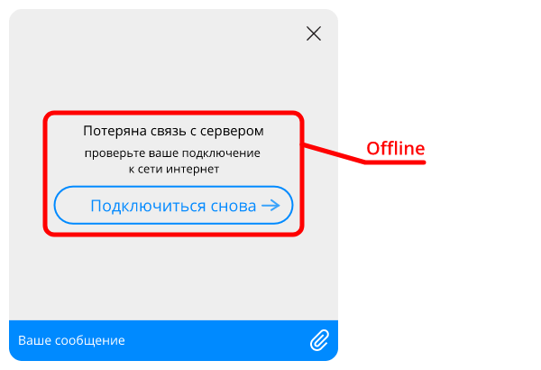

Экран недоступности сети

| Свойство в настройках | CSS-свойство | Описание |
|----------------------------------|--------------------------------|---------------------------------|
| backgroundColor | [background-color](http://htmlbook.ru/css/background-color) | Цвет фона |
| maxWidth | [max-width](http://htmlbook.ru/css/max-width) | Максимальная ширина |
| textAlign | [text-align](http://htmlbook.ru/css/text-align) | Выравнивание текста |
| textColor | [color](http://htmlbook.ru/css/color) | Цвет основного текста |
| textFontSize | [font-size](http://htmlbook.ru/css/font-size) | Размер шрифта основного текста |
| textFontFamily | [font-family](http://htmlbook.ru/css/font-family) | Семейство шрифта основного текста |
| textFontWeight | [font-weight](http://htmlbook.ru/css/font-weight) | Насыщенность шрифта основного текста |
| subtextColor | [color](http://htmlbook.ru/css/color) | Цвет дополнительного текста |
| subtextFontSize | [font-size](http://htmlbook.ru/css/font-size) | Размер шрифта дополнительного текста |
| subtextFontFamily | [font-family](http://htmlbook.ru/css/font-family) | Семейство шрифта дополнительного текста |
| subtextFontWeight | [font-weight](http://htmlbook.ru/css/font-weight) | Насыщенность шрифта дополнительного текста |
| buttonMargin | [margin](http://htmlbook.ru/css/margin) | Внешние отступы кнопки |

#### Preloader

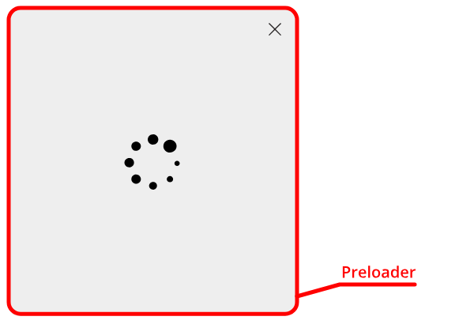

Прелоадер, блокирующий окно чата

| Свойство в настройках | CSS-свойство | Описание |
|----------------------------------|--------------------------------|---------------------------------|
| backgroundColor | [background-color](http://htmlbook.ru/css/background-color) | Цвет фона |
| spinnerBackgroundImage | [background-image](http://htmlbook.ru/css/background-image) | Изображение для прелоадера |

#### Preview

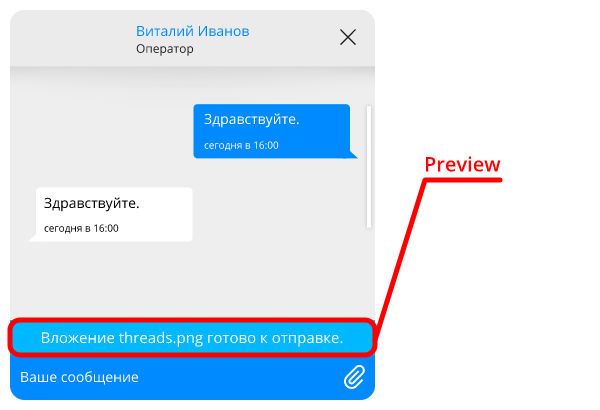

Область предпросмотра вложений и цитируемых сообщений

| Свойство в настройках | CSS-свойство | Описание |
|----------------------------------|--------------------------------|---------------------------------|
| padding | [padding](http://htmlbook.ru/css/padding) | Внутренние отступы |
| backgroundColor | [background-color](http://htmlbook.ru/css/background-color) | Цвет фона |
| color | [color](http://htmlbook.ru/css/color) | Цвет текста |
| fontSize | [font-size](http://htmlbook.ru/css/font-size) | Размер шрифта |
| fontFamily | [font-family](http://htmlbook.ru/css/font-family) | Семейство шрифта |
| attachmentIcon | [background-image](http://htmlbook.ru/css/background-image) | Пиктограмма вложения-документа |
| buttonBackgroundImage | [background-image](http://htmlbook.ru/css/background-image) | Изображение для кнопки "Закрыть" |
| buttonWidth | [width](http://htmlbook.ru/css/width) | Ширина кнопки "Закрыть" |
| buttonHeight | [height](http://htmlbook.ru/css/height) | Высота кнопки "Закрыть" |
| quotedMessageBorderLeft | [border-left](http://htmlbook.ru/css/border-left) | Граница слева для цитируемого сообщения |
| quotedMessageBorderRight | [border-right](http://htmlbook.ru/css/border-right) | Граница справа для цитируемого сообщения |
| quotedMessageBorderTop | [border-top](http://htmlbook.ru/css/border-top) | Граница сверху для цитируемого сообщения |
| quotedMessageBorderBottom | [border-bottom](http://htmlbook.ru/css/border-bottom) | Граница снизу для цитируемого сообщения |
| quotedMessagePadding | [padding](http://htmlbook.ru/css/padding) | Внутренние отступы цитируемого сообщения |
| quotedMessageWidth | [width](http://htmlbook.ru/css/width) | Ширина блока цитируемого сообщения |
| quotedMessageMargin | [margin](http://htmlbook.ru/css/margin) | Внешние отступы цитируемого сообщения |
| quotedMessageFontFamily | [font-family](http://htmlbook.ru/css/font-family) | Гарнитура текста цитируемого сообщения |
| quotedMessageColor | [color](http://htmlbook.ru/css/color) | Цвет текста цитируемого сообщения |
| quotedMessageFontSize | [font-size](http://htmlbook.ru/css/font-size) | Размер шрифта текста цитируемого сообщения |
| quotedMessageFontWeight | [font-weight](http://htmlbook.ru/css/font-weight) | Насыщенность шрифта текста цитируемого сообщения |
| linkFontFamily | [font-family](http://htmlbook.ru/css/font-family) | Гарнитура ссылки |
| linkFontSize | [font-size](http://htmlbook.ru/css/font-size) | Размер шрифта ссылки |
| linkColor | [color](http://htmlbook.ru/css/color) | Цвет текста ссылки |
| linkFontWeight | [font-weight](http://htmlbook.ru/css/font-weight) | Насыщенность шрифта ссылки |

#### QuickQuestions

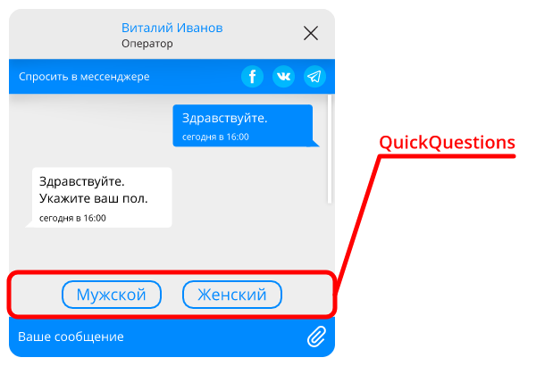

Панель быстрых ответов

| Свойство в настройках | CSS-свойство | Описание |
|----------------------------------|--------------------------------|---------------------------------|
| direction | [direction](http://htmlbook.ru/css/direction) | Расположение элементов. "row" (по умолчанию) - в ряд, "column" - колонкой |
| containerBackground | [background](http://htmlbook.ru/css/background) | Фон контейнера |
| buttonFontWeight | [font-weight](http://htmlbook.ru/css/font-weight) | Насыщенность шрифта элемента |
| buttonFontSize | [font-size](http://htmlbook.ru/css/font-size) | Размер шрифта элемента |
| buttonFontFamily | [font-family](http://htmlbook.ru/css/font-family) | Семейство шрифта элемента |
| buttonBorderRadius | [border-radius](http://htmlbook.ru/css/border-radius) | Скругление углов элемента |
| buttonMargin | [margin](http://htmlbook.ru/css/margin) | Внешние отступы элемента |
| buttonBorder | [border](http://htmlbook.ru/css/border) | Граница элемента |
| buttonBackground | [background](http://htmlbook.ru/css/background) | Фон элемента |
| buttonColor | [color](http://htmlbook.ru/css/color) | Цвет текста элемента |
| buttonBorderHover | [border](http://htmlbook.ru/css/border) | Граница элемента (при наведении) |
| buttonBackgroundHover | [background](http://htmlbook.ru/css/background) | Фон элемента (при наведении) |
| buttonColorHover | [color](http://htmlbook.ru/css/color) | Цвет текста элемента (при наведении) |
| buttonBorderActive | [border](http://htmlbook.ru/css/border) | Граница элемента (при нажатии) |
| buttonBackgroundActive | [background](http://htmlbook.ru/css/background) | Фон элемента (при нажатии) |
| buttonColorActive | [color](http://htmlbook.ru/css/color) | Цвет текста элемента (при нажатии) |

#### ScrollButton

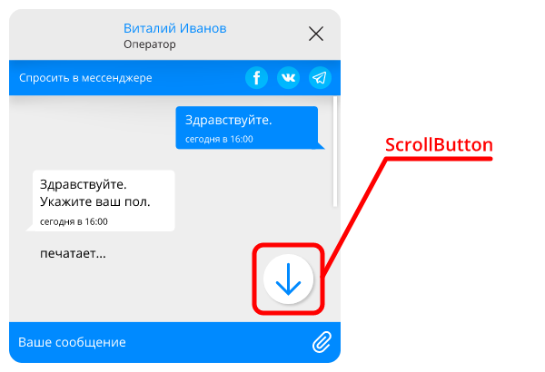

Кнопка прокрутки области переписки вниз.

| Свойство в настройках | CSS-свойство | Описание |
|----------------------------------|--------------------------------|---------------------------------|
| marginTop | [margin-top](http://htmlbook.ru/css/margin-top) | Внешний верхний отступ |
| width | [width](http://htmlbook.ru/css/width) | Ширина кнопки |
| height | [height](http://htmlbook.ru/css/height) | Высота кнопки |
| backgroundSize | [background-size](http://htmlbook.ru/css/background-size) | Размер изображения на кнопке |
| backgroundImage | [background-image](http://htmlbook.ru/css/background-image) | Путь к изображению на кнопке |
| backgroundColor | [background-color](http://htmlbook.ru/css/background-color) | Цвет фона кнопки |

#### ScrollButtonBadge

Счетчик непрочитаннх сообщений у кнопки прокрутки области переписки вниз.

| Свойство в настройках | CSS-свойство | Описание |
|----------------------------------|--------------------------------|---------------------------------|
| color | [color](http://htmlbook.ru/css/color) | Цвет текста |
| fontFamily | [font-family](http://htmlbook.ru/css/font-family) | Семейство шрифта |
| fontSize | [font-size](http://htmlbook.ru/css/font-size) | Размер шрифта |
| backgroundColor | [background-color](http://htmlbook.ru/css/background-color) | Цвет фона пузыря |
| height | [height](http://htmlbook.ru/css/height) | Высота |
| width | [width](http://htmlbook.ru/css/width) | Ширина для счетчика |
| top | [top](http://htmlbook.ru/css/top) | Позиционирование относительно верхнего края кнопки скролла |

#### SocialLinks

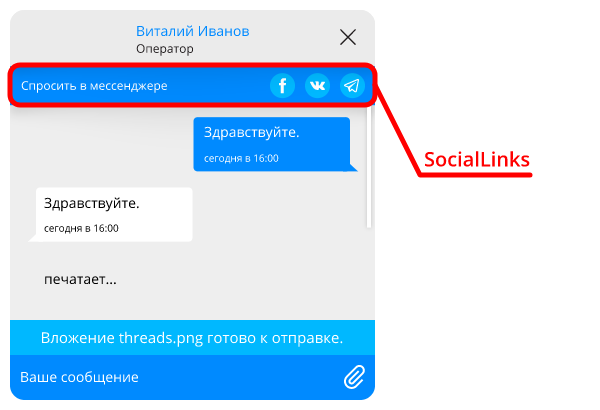

Панель внешних ссылок

| Свойство в настройках | CSS-свойство | Описание |
|----------------------------------|--------------------------------|---------------------------------|
| padding | [padding](http://htmlbook.ru/css/padding) | Внутренние отступы секции |
| backgroundColor | [background-color](http://htmlbook.ru/css/background-color) | Цвет фона секции |
| fontFamily | [font-family](http://htmlbook.ru/css/font-family) | Семейство шрифта |
| fontSize | [font-size](http://htmlbook.ru/css/font-size) | Размер шрифта |
| color | [color](http://htmlbook.ru/css/color) | Цвет текста |
| cellWidth | [width](http://htmlbook.ru/css/width) | Ширина выделенного места под кнопку |
| buttonSize | [width](http://htmlbook.ru/css/width) | Размер кнопки (высота и ширина) |
| buttonBackgroundColor | [background-color](http://htmlbook.ru/css/background-color) | Цвет фона кнопки |
| buttonImageSize | [background-size](http://htmlbook.ru/css/background-size) | Размер изображения на кнопке |

#### Typing

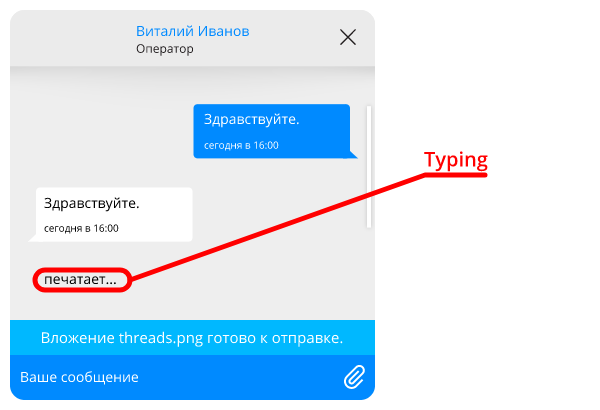

Уведомление о том, что оператор набирает сообщение

| Свойство в настройках | CSS-свойство | Описание |
|----------------------------------|--------------------------------|---------------------------------|
| avatarDisplay | [display](http://htmlbook.ru/css/display) | Способ отображения аватара |
| color | [color](http://htmlbook.ru/css/color) | Цвет текста |
| opacity | [opacity](http://htmlbook.ru/css/opacity) | Непрозрачность текста |
| fontSize | [font-size](http://htmlbook.ru/css/font-size) | Размер шрифта |
| containerPadding | [padding](http://htmlbook.ru/css/padding) | Внутренние отступы блока |
| containerBackground | [background](http://htmlbook.ru/css/background) | Цвет фона блока |
| containerWidth | [width](http://htmlbook.ru/css/width) | Ширина блока |
| borderTopLeftRadius | [border-top-left-radius](http://htmlbook.ru/css/border-top-left-radius) | Скругление верхнего левого угла |
| borderBottomLeftRadius | [border-bottom-left-radius](http://htmlbook.ru/css/border-bottom-left-radius) | Скругление нижнего левого угла |
| borderTopRightRadius | [border-top-right-radius](http://htmlbook.ru/css/border-top-right-radius) | Скругление верхнего правого угла |
| borderBottomRightRadius | [border-bottom-right-radius](http://htmlbook.ru/css/border-bottom-right-radius) | Скругление нижнего правого угла |
| animationPreset | - | Тип анимации, целое число от 1 до 2 |

#### WebView

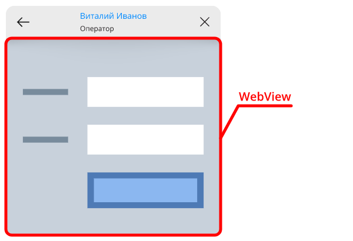

Контейнер, позволяющий отображать контент со стороннего ресурса

| Свойство в настройках | CSS-свойство | Описание |
|----------------------------------|--------------------------------|---------------------------------|
| backgroundColor | [background-color](http://htmlbook.ru/css/background-color) | Цвет фона |
| errorTextColor | [color](http://htmlbook.ru/css/color) | Цвет сообщения об ошибке |
| errorTextFontSize | [font-size](http://htmlbook.ru/css/font-size) | Размер шрифта сообщения об ошибке |
| errorTextFontFamily | [font-family](http://htmlbook.ru/css/font-family) | Семейство шрифта сообщения об ошибке |
| errorTextTextAlign | [text-align](http://htmlbook.ru/css/text-align) | Выравнивание текста сообщения об ошибке |


