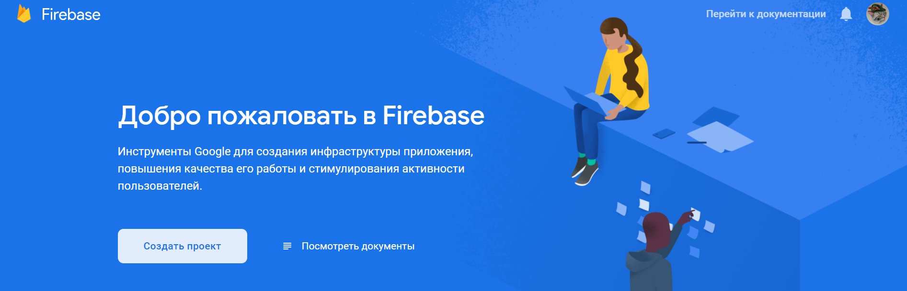
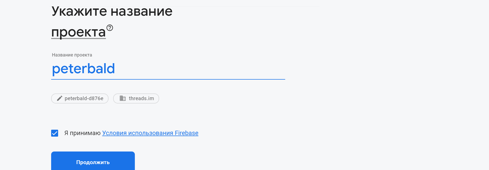
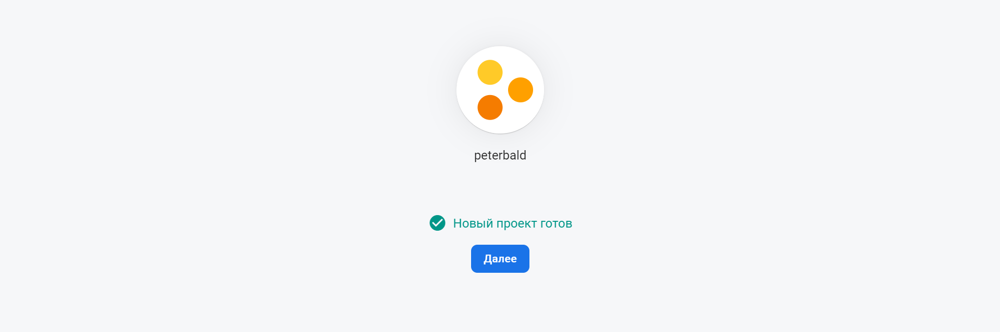
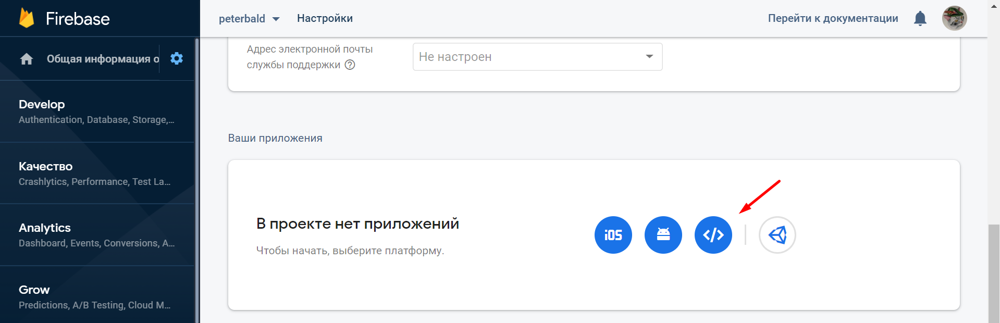
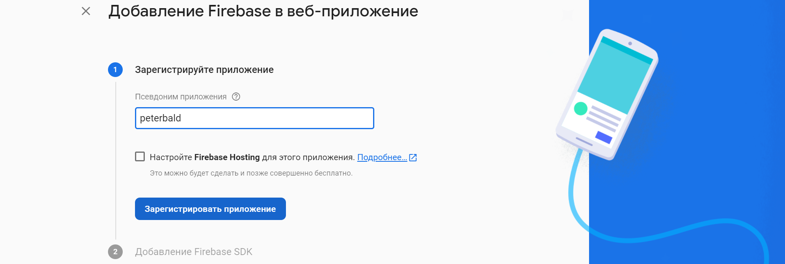
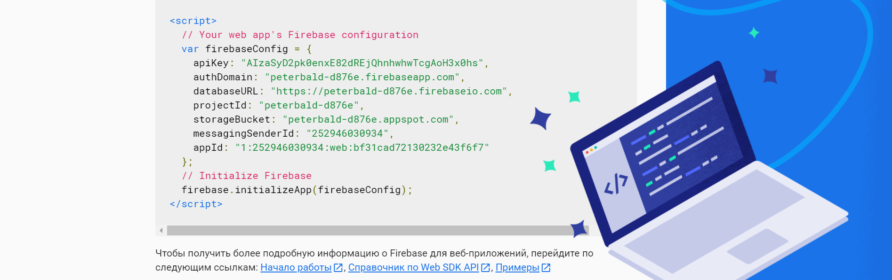
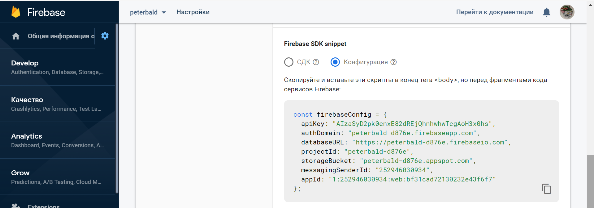
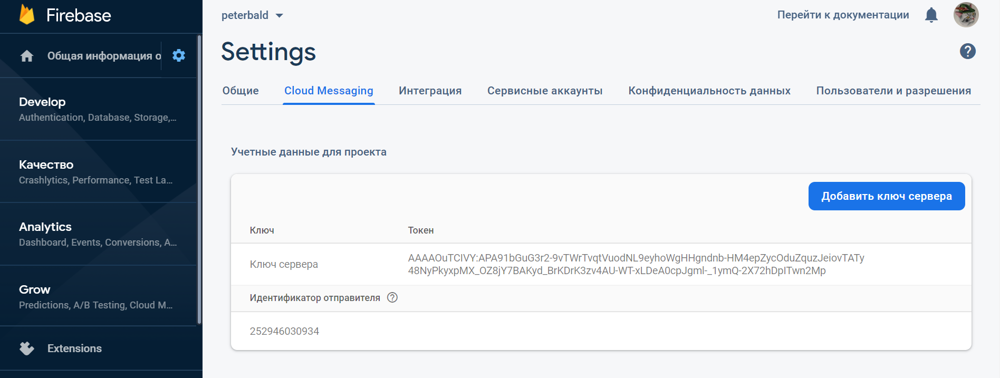

## Руководство по началу работы

Виджет Чата предназначен для взаимодействия ваших клиентов и компании, обеспечивает прием и отправку сообщений. Передача сообщений происходит с помощью протокола WebSocket.

В этом руководстве вы найдете инструкции для настройки и включения чата на своем сайте.

## Следуйте приведенному алгоритму:

### 1. Получите у аккаунт-менеджера реквизиты для подключения библиотеки для следующих параметров:

    webchat/package 
    webchat/uid
    webchat/websocket
    webchat/datastore 
    webchat/apiUrl
    webchat/history/url 
    webchat/unauthorizedHistory/url


### 2. Скачайте актуальную версию виджета для настройки чата

**Важно: версия виджета не должна быть новее версии backend приложения**

Из раздела [releases](https://github.com/ThreadsMobileLib/threads-sdk-web-gate/releases)

Либо с [главной страницы](https://github.com/ThreadsMobileLib/threads-sdk-web-gate) -> нажать на кнопку `Code` -> нажать на `Download ZIP`


### 3. Разместите файлы виджета `***.min.js`, `***.min.css` в корне или каком-либо каталоге своего сайта


### 4. Скачайте пример конфигурационного файла [`settings.json`](https://github.com/ThreadsMobileLib/threads-sdk-web-gate/blob/master/examples/Standard/settings.json)

Все настройки виджета производятся в данном файле. Путь к нему необходимо будет указать далее при инициализации виджета (п.9)


### 5. Настройте в файле `settings.json` параметры, данные которых были получены от аккаунт-менеджера на шаге 1.


### 6. Настройте цветовую схему, подходящую вашему сайту.

В секции `skin`. В примере файла параметры отвечают за цвета следующих элементов:

Поле | Описание | Значение по умолчанию
--- | --- | ---
`name` | Название темы оформления. Список доступных тем:<br>`mfms`, `threadsim`, `halcyon`, `adaptive` | `"threadsim"`
`width` | Ширина виджета | `"366px"`
`height` | Высота виджета | `"420px"`
`colorMain` | Основной базовый цвет | `"#008aff"`
`colorSecond` | Дополнительный базовый цвет | `"#05b8ff"`
`colorLines` | Цвет линий и сообщений оператора | `"#dee4e9"`
`colorSubText` | Цвет дополнительного текста | `"#6e6e6e"`
`colorText` | Цвет текста | `"#000000"`
`colorBackground` | Фон виджета | `"#ffffff"`


<table>
<tr>
    <td>
        
    </td>
    <td valign="top">
        <b>colorMain</b><br>
        1: фон сообщений клиента<br>
        2: фон поля ввода сообщения<br>
        <br>
        <b>colorSecond</b><br>
        3: фон области предпросмотра вложений<br>
        <br>
        <b>colorLines</b><br>
        4: фон сообщений оператора<br>
        <br>
        <b>colorSubText</b><br>
        5: цвет кнопки скрытия чата<br>
        6: цвет системных сообщений<br>
        <br>
        <b>colorText</b><br>
        7: цвет текста в шапке<br>
        <br>
        <b>colorBackground</b><br>
        8: фон виджета<br>
        9: цвет текста области предпросмотра вложений<br>
        10: цвет текста поля ввода сообщения<br>
    </td>
</tr>
</table>


### 7. Настройте WebPush уведомления: 

Создайте проект Firebase для работы пушей.

<details>
    <summary>Инструкция по регистрации в Firebase:</summary>

Создать новый проект



Указать название проекта, выбрать домен



Проект будет создан



На странице проекта навести на колесо в разделе Общая информация (Overview) и перейти в настройки проекта


Открыть Общие настройки, прокрутить вниз и нажать на кнопку создания приложения



Указать псевдоним приложения



Получить сгенерированный скрипт service worker



Конфиг service worker приложения останется доступен на странице Настройки/Общие настройки
**Параметры этого конфига потребуются на следующих шагах для настройки виджета**



В разделе Cloud Messaging получить api_key и senderID

</details>


Скачайте [firebase-messaging-sw.js](https://github.com/ThreadsMobileLib/threads-sdk-web-gate/tree/master/examples/Standard/firebase-messaging-sw.js).

Настройте файл. В `config` приведите параметры service worker для виджета:
```javascript
var config = {
    "enable": false,
    "firebaseConfig": {
        "apiKey": "FIX_ME",
        "authDomain": "FIX_ME",
        "databaseURL": "FIX_ME",
        "projectId": "FIX_ME",
        "storageBucket": "FIX_ME",
        "messagingSenderId": "FIX_ME",
        "appId": "FIX_ME"
    },
    "title": "Threads Chat",
    "icon": "data:image/png;base64,iVBORw0KGgoAAAANSUhEUgAAADIAAAAyCAMAAAAp4XiDAAAABGdBTUEAALGPC/xhBQAAAAFzUkdCAK7OHOkAAABOUExURUxpcejo6Onp6enp6eTk5Onp6erq6uvr6+np6eXl5enp6ejo6Ovr6+zs7Ojo6Onp6ePj4+rq6pmZmdPT06enp+bm5p6entra2sLCwrm5ueNweO8AAAARdFJOUwBOiKUcunn78A3dnllqk8XwLooT9gAAAWVJREFUSMedllmShSAMRXHggYq+YhLd/0bbtluLJODA/SR1yiQmFxgj6tTEeymE7PmkOnarduRCRxJ8bK+BQSc05KGuljopWWfyqzLADlUp4qMv9aFJNfpGDUqu++pbfSHT6AdqXtSRqKeiUR+Cp6dn3zrcXW+d2eQs6fVRTo0CYQd2KKBQ/T8l6CNhNqdmxMi/2UFz5SNiY1BFw/4R9O3VAK0o/PuZEZ3NEJlReNwQjvIySCgzvnVYvENEx5R+h2jFprfIhEu5Rzjr3yI9I9t702QtmcBHDiIOxwVFFogsFCGJBYgEmlivLzMjeW3lc3JmY4Rs2dbkia7rmp/j/VcquvYxQg1A0bFc4IotdCxhMQhIQBytmHUmIeA0I1jkkASQ07SxXQRzoRDbxWlK9gqxwJQO63uC1NBgvcsTzkODPWzc26w8svGSy6LkSiq5+Aqu15JLvOipUPIgKXn2FD2uHj3hfgChdIQNPQdYDAAAAABJRU5ErkJggg=="
};
```

где:
- `enable` - настройка включения/выключения функционала (значения: `true`, `false`);
- `firebaseConfig` - параметры подключений к платформе firebase, настройка service worker;
- `title` - заголовок, который будет видеть клиент в пуш-уведомлении;
- `icon` - иконка пуш-уведомления в формате base64.

Аналогично настройте секцию `pushNotification` в файле конфигурации `settings.json`.

Передайте вашему аккаунт-менеджеру значения `sender_id` (`Идентификатор отправителя`) и `api_key` (`Ключ`) из вашего проекта Firebase (указаны в разделе `Cloud Messaging`) 

Файл `firebase-messaging-sw.js` разместите в корне сайта. Данный скрипт должен быть доступен по адресу `http(s)://****/firebase-messaging-sw.js` (`****` - домен на котором осуществляете настройки).


### 8. Скачайте файл [web-notification-sw.js]([../demo/Standart](https://github.com/ThreadsMobileLib/threads-sdk-web-gate/tree/master/examples/Standard/web-notification-sw.js)

Файл `web-notification-sw.js` разместите в корне сайта. Данный скрипт должен быть доступен по адресу `http(s)://****/web-notification-sw.js` (`****` - домен на котором осуществляете настройки).
Это необходимо для работы браузерных веб-нотификаций о получении новых сообщений в виджете.


### 9. Встройте виджет на сайт: 

Подключите виджет: 
Для установки виджета Чата на странице, где он будет отображаться, необходимо перед закрывающим тегом `</body>` добавить следующий инициализационный код:
```javascript
<!-- BEGIN THREADS {literal} -->
<script type="text/javascript">
!function(configurationFile,e){"use strict";configurationFile=configurationFile||"/settings.json";var t=window,a=document;t.ThreadsWidget={isDummy:!0},["hideInvite","version","commitHash","showChat","hideChat","onHideChat","onScenarios","onLoad"].forEach(function(e){t.ThreadsWidget[e]=function(a){var n,i,o;n=e,i=a,o=setInterval(function(){t.ThreadsWidget&&!t.ThreadsWidget.isDummy&&(clearInterval(o),t.ThreadsWidget[n]&&t.ThreadsWidget[n](i))},100)}});var n,i=(n=new XMLHttpRequest,function(e,t,a,i){n.onreadystatechange=function(){if(4===n.readyState)if(200===this.status)a(n.response);else{if("function"!=typeof i)throw new Error(n.response);i(n)}},n.open(e,t),n.send()});function o(t){t.webchat&&(t.webchat.filename=t.filename),t.style&&(t.webchat.style=t.style),e&&"string"==typeof e&&(t.webchat.currentLocale=e),e&&"object"==typeof e&&(e.locale&&"string"==typeof e.locale&&(t.webchat.currentLocale=e.locale),e.unavailable&&"boolean"==typeof e.unavailable&&(t.webchat.isUnavailableOnStart=e.unavailable));try{sessionStorage.setItem("__threadsWidget",JSON.stringify(t.webchat))}catch(e){window.__threadsWidget=JSON.stringify(t.webchat)}if(t.filename){var n=a.createElement("script");n.type="text/javascript",n.async=!0,n.src=t.filename;var i=a.getElementsByTagName("script")[0];i?i.parentNode.insertBefore(n,i):a.body.appendChild(n)}else console&&console.error("Invalid bundle")}function s(){i("GET",configurationFile+"?rnd="+Math.random(),function(e){var t=JSON.parse(e);o(t)})}"complete"===a.readyState?s():t.attachEvent?t.attachEvent("onload",s):t.addEventListener("load",s,!1)}("settings.json",{});
</script>
<!-- {/literal} END THREADS -->
```

Подключите файл настроек, указав в самом конце скрипта инициализации путь к `settings.json`: 
```
...}("settings.json");
```
Обязательно установите в качестве значения этого параметра абсолютный путь к файлу настроек от корня вашего сайта. Пример: `("/your/path/to/settings.json")`

Сохраните изменения и опубликуйте их на своем сайте

### 10. Откройте страницу на своем сайте

### 11. В случае корректной настройки в нижнем правом углу браузера появится кнопка для открытия чата. При нажатии на нее загрузится стартовое окно чата.

После встраивания убедитесь, что все настройки выполнены корректно, проведя несколько простых базовых тестов:
- Авторизуйтесь в Интерфейсе оператора Threads и переведите оператора в статус "Активен" с помощью ползунка в правой верхней части интерфейса (реквизиты для доступа вам сообщит аккаунт-менеджер);
- Отправьте сообщение из виджета. В интерфейсе оператора вы увидите обращение из чата;
- Ответьте на сообщение в Интерфейсе оператора. В чате вы увидите ответ оператора;
- Попробуйте отправить таким образом несколько сообщений, в том числе отправить вложения. Убедитесь, что после прочтения сообщения получателем в чате отправителя у сообщения появляются 2 галочки, свидетельствующие о работе статусов прочитанности;

При возникновении проблем с отправкой и/или получением сообщений необходимо проверить корректность выполненных настроек.

В случае возникновения вопросов по деталям настройки вы всегда можете уточнить необходимую информацию у наших инженеров внедрения, написав на [support@mfms.ru](mailto:support@mfms.ru), или обратиться к своему аккаунт-менеджеру
